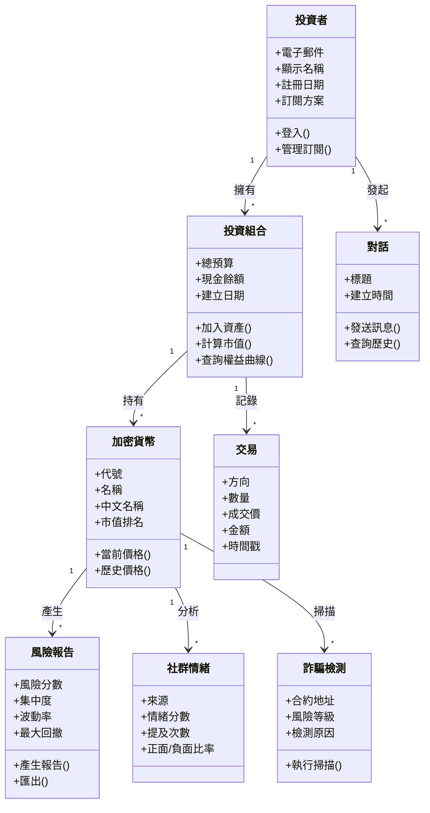
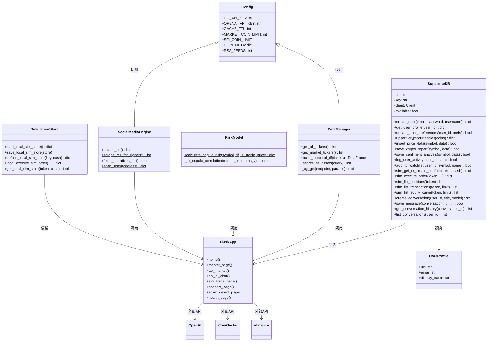
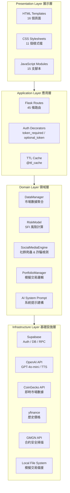
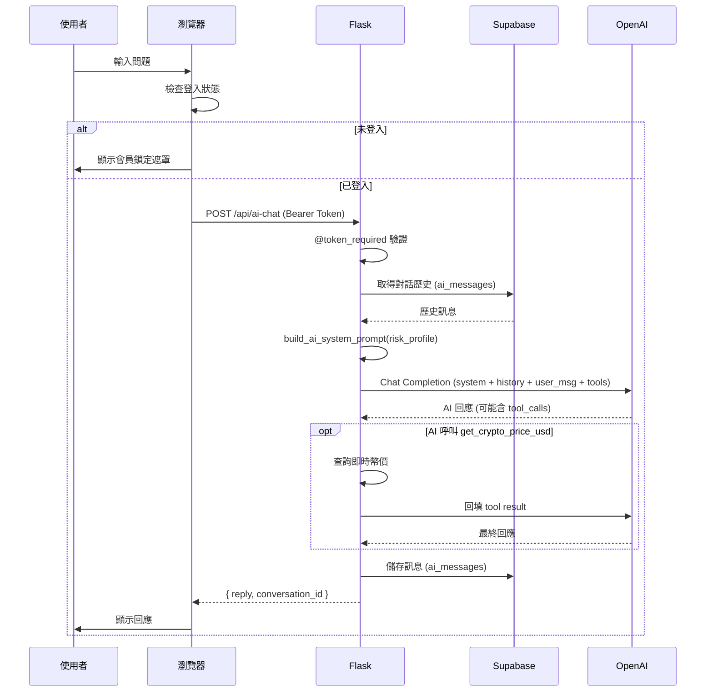
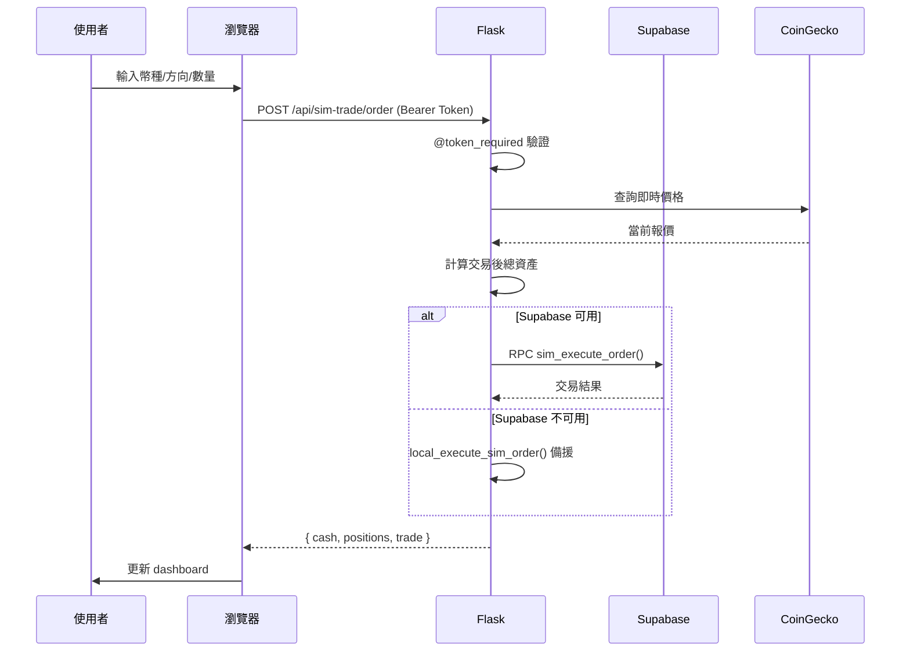
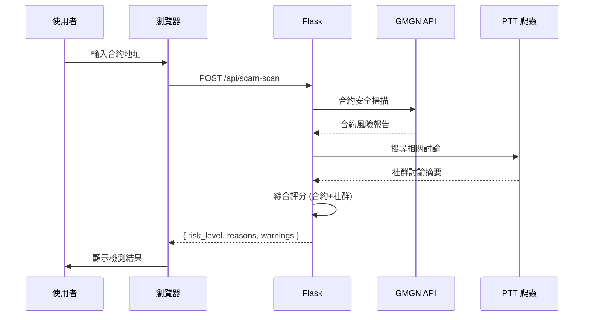
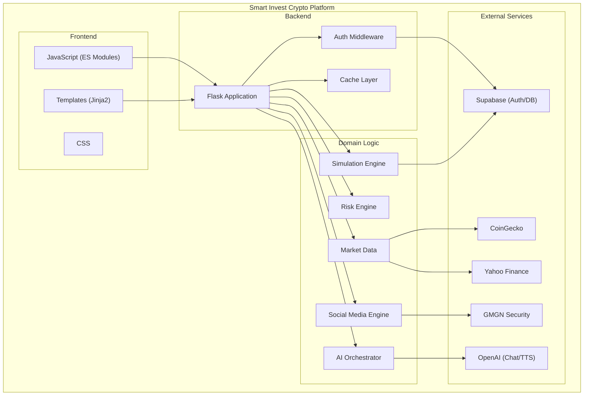

# 第 6 章 設計模型

> 本章包含系統設計模型的完整說明，涵蓋分析類別圖（問題域）、設計類別圖（解決方案域）、循序圖、系統分層架構圖。

## 6-1 分析類別圖 vs 設計類別圖

### 6-1-1 為什麼需要兩種圖？

| | 分析類別圖 (Analysis Class Diagram) | 設計類別圖 (Design Class Diagram) |
|---|---|---|
| **關注點** | 問題域（What） | 解決方案域（How） |
| **抽象層級** | 高層次，與技術無關 | 低層次，包含框架與實作細節 |
| **對象** | 領域專家、需求分析師 | 開發者、架構師 |
| **內容** | 邊界類別、控制類別、實體類別 | 具體類別、方法簽章、框架繼承 |
| **技術細節** | 無（不指定語言/框架） | 有（Python/Flask/Supabase） |

**在此專案中的分工**：
- 分析類別圖：描述「加密貨幣投資者需要哪些概念」（如 Account、Portfolio、RiskReport），與技術無關
- 設計類別圖：描述「Flask 如何實現這些概念」（如 Config、SupabaseDB、FlaskApp、DataManager），包含具體方法與依賴關係

### 6-1-2 UML Visibility 標記說明

| 標記 | 名稱 | 意義 | Python 對應 |
|------|------|------|-------------|
| `+` | Public | 任何類別皆可存取 | 一般方法/屬性 |
| `-` | Private | 僅該類別內部可存取 | `__method` / `_method` |
| `#` | Protected | 該類別與子類別可存取 | `_method`（慣例） |
| `~` | Package | 同一套件內可存取 | 較少使用 |

---

## 6-2 分析類別圖（問題域）

以下為系統的問題域模型，不含技術實作細節。

---

## 6-3 設計類別圖（解決方案域）

以下為系統的實作層級設計類別圖，對應 `app.py` + `supabase_client.py` 的實際結構。

---

## 6-4 系統分層架構圖

系統採用 **四層架構（Layered Architecture）**：

---

## 6-5 關鍵循序圖

### 6-5-1 AI 投資教練對話流程

### 6-5-2 模擬交易下單流程

### 6-5-3 詐騙檢測流程

---

## 6-6 元件圖（Component Diagram）

---

> 本章所有 Mermaid 圖表可在支援 Mermaid 的 Markdown 編輯器中直接渲染，亦可用 `scripts/markdown_to_image.py` 轉換為 PNG。
