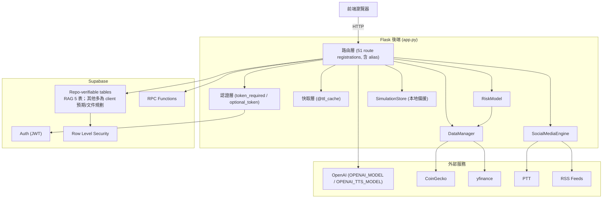
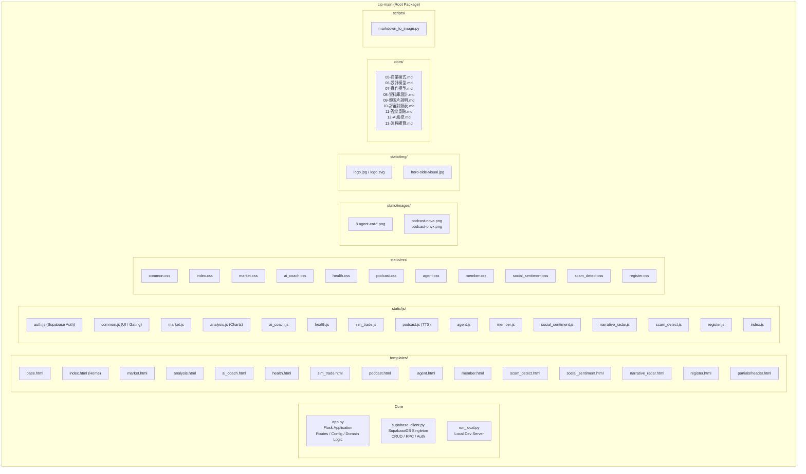

# 第 7 章 實作模型

> 本章說明系統實作架構、核心模組、API 設計、前端互動機制、資料清洗流程與套件結構。

## 7-1 技術棧總覽

| 層級 | 技術 | 用途 |
|------|------|------|
| 前端 | HTML5 + CSS3 + Vanilla JS (ES Modules) | 15 個頂層 template、11 樣式檔、15 腳本 |
| 後端框架 | Flask (Python) | 51 個 `@app.route` 註冊（含 alias）、RESTful API |
| 資料庫 | Supabase (PostgreSQL) | Auth、RLS、RPC、Tables |
| AI 模型 | OpenAI（文字模型以 env 設定，預設 `gpt-5.4`） | 對話、Podcast 生成、TTS |
| 市場數據 | CoinGecko API + yfinance | 即時價格、歷史K線 |
| 社群數據 | PTT 爬蟲 + RSS (feedparser) | 情緒分析、敘事雷達 |
| 可疑文案 | 文字規則 + 本地 RAG + OpenAI | 文案風險辨識；未串合約/網域/鏈上掃描 |
| 部署 | Render (Web Service) + Gunicorn | 生產環境 |
| 語音合成 | `OPENAI_TTS_MODEL`（預設 `gpt-4o-mini-tts`）+ Web Speech API | Podcast 雙聲線 + 瀏覽器 fallback |

## 7-2 系統實作架構圖



## 7-3 核心模組實作細節

### 7-3-1 Config（系統設定）

```python
class Config:
    CG_API_KEY: str           # CoinGecko API key
    CACHE_TTL: int = 300      # 快取 5 分鐘
    MARKET_COIN_LIMIT: int    # 市場頁顯示幣種數 (env: MARKET_COIN_LIMIT, default 24)
    SFI_COIN_LIMIT: int       # SFI 分析幣種數 (env: SFI_COIN_LIMIT, default 20)
    OPENAI_API_KEY: str       # OpenAI API key
    COIN_META: dict           # 幣種元數據 (icon, 中文名, 共識機制, 板塊)
    RSS_FEEDS: list           # RSS 訂閱源 (CoinDesk, CoinTelegraph)
```

**對應程式碼位置**：`app.py` 的 `Config`

### 7-3-2 DataManager（市場數據管理）

負責所有外部市場數據的獲取、快取、聚合：

- `get_all_tickers()` → CoinGecko `/coins/markets` (SFI_COIN_LIMIT 個幣種, sparkline=true)
- `get_market_tickers()` → CoinGecko `/coins/markets` (MARKET_COIN_LIMIT 個幣種, sparkline=false)
- `build_historical_df(tickers)` → yfinance 歷史價格 + 報酬率矩陣
- `search_sfi_assets(query)` → 對 ticker 列表做模糊搜尋
- `_cg_get(endpoint, params)` → CoinGecko API 封裝（含 error handling）

**對應程式碼位置**：`app.py` 的 `DataManager`

### 7-3-3 RiskModel（風險計算引擎）

- `calculate_copula_risk(symbol, df, is_stable, price)` → SFI 綜合風險分數
  - 計算各幣種對 BTC 的 Beta
  - 以 Clayton Copula 擬合尾部相關性
  - 計算 lambda_lower（尾部依賴係數）
  - 正規化為 0–100 的 SFI 分數
  - 分級：`>=65 danger` / `40-64 warning` / `<40 safe`

**對應程式碼位置**：`app.py` 的 `RiskModel.calculate_copula_risk`

### 7-3-4 SocialMediaEngine（社群數據引擎）

- `scrape_ptt()` → 爬取 PTT DigiCurrency 板
  - 3 次重試、5 秒 backoff、瀏覽器級 headers
  - `ThreadPoolExecutor(max_workers=5)` 並行處理
  - 每頁上限 15 篇文章、目前最多 2 頁

- `scrape_rss_for_signals()` → RSS 新聞信號提取
  - 從 CoinDesk/CoinTelegraph RSS 提取標題與摘要
  
- `fetch_narratives_full()` → 敘事雷達分類
  - 關鍵字匹配：BTC/ETH/DeFi/L2/Meme/RWA/AI/GameFi/Regulation


> 詐騙文案風險辨識不屬於 `SocialMediaEngine`；實際路徑在 `app.py` 的 `_evaluate_scam_text_rules()` / `_build_scam_business()` 與 `/api/scam-scan`。目前不呼叫 GMGN、WHOIS 或 PTT 作為詐騙證據。

**對應程式碼位置**：`app.py` 的 `SocialMediaEngine`、`_evaluate_scam_text_rules`與 `/api/scam-scan`

### 7-3-5 SimulationStore（本地模擬交易備援）

當 Supabase 不可用時的本地 JSON 備援：

- `local_execute_sim_order(access_token, symbol, side, price, quantity, amount)`
- `get_local_sim_state(access_token, initial_cash)` → 讀取/建立本地狀態
- `save_local_sim_store(store)` → 寫入 `data/sim_trade_local.json`
- `append_local_equity_point(state, total_value, cash)` → 權益曲線（保留最近 80 點）
- `local_position_rows(state)` → 整理持倉列表

**對應程式碼位置**：`app.py` 的 local simulation helpers（`get_local_sim_state`、`local_execute_sim_order` 等）

### 7-3-6 SupabaseDB（資料庫封裝）

封裝專案目前會使用的 Supabase 操作，並提供通用 CRUD helper。詳見 `supabase_client.py`（目前約 639 行）。有 client method 不等於 repo 已包含對應 DDL/RLS/RPC migration，詳見 `docs/18-系統功能與資料一致性矩陣.md`。

**對應程式碼位置**：`supabase_client.py` 的 `SupabaseDB`

## 7-4 API 設計總覽

### 7-4-1 公開 API（無需驗證）

| Method | Route | 功能 | 快取 |
|--------|-------|------|------|
| GET | `/api/market` | 市場總覽（24 幣種） | 5 min |
| GET | `/api/coingecko` | 完整市場數據（20 幣種+風險） | 5 min |
| GET | `/api/details/<symbol>` | 單幣歷史數據 | 5 min |
| GET | `/crypto/popular` | 熱門幣種 | 5 min |
| GET | `/crypto/series?ticker=BTC&days=7` | 歷史價格序列 | 5 min |
| GET | `/api/sfi/search?q=...` | SFI 資產搜尋 | - |
| POST | `/api/check-fomo` | FOMO 追高檢測 | - |
| GET | `/api/social-data` | 社群情緒數據 | 即時 |
| GET | `/api/narratives` | 敘事雷達數據 | 即時 |
| POST | `/api/scam-scan` | 可疑文案風險辨識 | 即時 |
| POST | `/podcast/generate` | Podcast 生成 (訪客可用) | - |
| POST | `/podcast/tts` | Podcast TTS | - |

### 7-4-2 會員限定 API（需 Bearer Token）

| Method | Route | 功能 |
|--------|-------|------|
| POST | `/api/ai-chat` | AI 投資教練對話 |
| GET | `/api/ai-chat/history?conversation_id=` | 對話歷史 |
| GET | `/api/ai-chat/conversations` | 會話列表 |
| GET | `/api/sim-trade/portfolio` | 模擬交易持倉 |
| GET | `/api/sim-trade/history` | 模擬交易紀錄 |
| POST | `/api/sim-trade/order` | 模擬交易下單 |
| POST | `/api/sim-trade/reset` | 重置模擬帳戶 |
| POST | `/api/sim-trade/deposit` | 模擬入金 |
| DELETE | `/api/sim-trade/capital/<id>` | 刪除資金紀錄 |
| POST | `/api/agent-plan` | AI Agent 配置計畫 |
| POST | `/api/agent-auto-order` | AI Agent 自動下單 |
| POST | `/portfolio/risk-health` | 組合健康度檢查 |
| POST | `/portfolio/analyze-llm` | AI 組合分析 |
| POST | `/api/rag-feedback` | 對本人 trace 提交 up/down feedback |

### 7-4-3 RAG 管理 API

| Method | Route | 權限 | 功能 |
|---|---|---|---|
| GET | `/api/rag/stats` | public | 只回安全 health summary |
| GET | `/api/rag/stats/details` | verified admin | aggregate details |
| POST | `/api/rag/rebuild-index` | verified admin | 重建索引，單程序併發鎖 |
| POST | `/api/rag/eval` | verified admin | bounded smoke evaluation |

## 7-5 前端與後端互動

### 7-5-1 認證流程

```
1. 頁面載入 → auth.js 初始化 Supabase client
2. 檢查 URL hash (OAuth redirect) → 解析 session
3. 檢查 localStorage (持久化 session)
4. 發布 smartinvest:auth-ready 事件
5. common.js 的 waitForSmartInvestAuth() 等待此事件
6. 頁面 JS 根據 auth state 設定 UI (locked/unlocked)
```

### 7-5-2 會員 Gating 機制

三層防護：

1. **導覽列**：`data-member-required` 屬性 + common.js click 攔截
2. **頁面遮罩**：`member-gate` div (sim_trade / ai_coach) + `member-lock-banner` (health / member)
3. **API 驗證**：`@token_required` decorator → 401 response → JS 自動鎖定

## 7-6 爬蟲資料清洗流程

### 7-6-1 PTT 資料清洗

```
輸入: PTT DigiCurrency 板 HTML
  ↓
1. HTML 解析 (BeautifulSoup)
2. 提取: 標題、作者、日期、推文數、內文摘要
3. 只保留有可用標題與連結的列表項
4. 取得內文後移除文章 metadata/push DOM，摘要限 80 字
  ↓
輸出: [{source, title, author, date, push, link, content}]
```

### 7-6-2 RSS 新聞清洗

```
輸入: CoinDesk + CoinTelegraph RSS feeds
  ↓
1. feedparser 解析
2. 各 feed 最多取前 20 筆，提取標題、摘要、發布時間與連結
3. 摘要只做 HTML tag 移除與 trim
4. 敘事雷達另以關鍵字計數分類
  ↓
輸出: [{source, title, summary, published, narrative_tags}]
```

### 7-6-3 現行品質限制

| 資料源 | 過濾方式 | 
|--------|---------|
| CoinGecko | 市場 API 失敗時回空/降級；未有獨立 anomaly-validation pipeline |
| yfinance | 歷史序列會對齊報酬率後 `dropna`；不應聲稱已完成所有異常值清洗 |
| PTT | 目前沒有機器人/廣告分類器、URL 去重或 24h 合併 |
| RSS | 目前沒有 Sponsored/PR 過濾或 48h 時間窗 |

> `analyze_posts()` 現階段含啟發式品質分數與隨機 sentiment label，只適合 demo，不可當成已驗證的情緒模型或準確率證據。

## 7-7 套件圖（Package Diagram）



---

## 7-8 錯誤處理與容錯設計

| 情境 | 處理方式 | 使用者體驗 |
|------|---------|-----------|
| Supabase 無法連線 | `SupabaseDB.__bool__()` 回傳 False，所有 DB 操作 skip | 模擬交易回落本地 JSON，AI 教練顯示「資料庫暫時不可用」 |
| OpenAI API key 未設定 | `Config.OPENAI_API_KEY` 為空，跳過 AI 功能 | Podcast 顯示「請設定 OPENAI_API_KEY」，瀏覽器 TTS fallback |
| CoinGecko API 超時 | try/except + 回傳空陣列 | 市場頁面顯示「資料載入中，請稍後再試」 |
| PTT 爬蟲被封 | 3 次重試 + 5s backoff + browser headers | 若全失敗，社群區塊顯示「目前無法取得 PTT 資料」 |
| matplotlib 未安裝 | `try/except ImportError` → `plt = None` | 分析圖表區塊顯示空狀態 |

---

> 本章以 repository 可驗證程式為準；資料表/RPC 的 implemented/partial/planned 分級與差異見 `docs/18-系統功能與資料一致性矩陣.md`。
