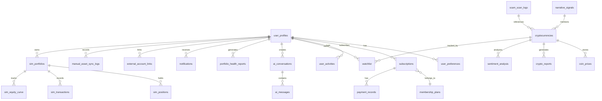

# 第 8 章 資料庫設計

> 本章說明 Smart Invest Crypto 的資料庫現況與規劃。「出現在資料字典」不等於「已有 migration/已部署」；表級狀態以 §8-2 盤點與 `docs/18-系統功能與資料一致性矩陣.md` 為準。

## 8-1 資料庫總覽

採用 **Supabase (PostgreSQL)** 作為資料庫引擎，具備：
- 內建 Auth（JWT + Row Level Security）
- RESTful API 自動生成
- RPC（PostgreSQL Functions）處理複雜交易邏輯
- 即時訂閱（WebSocket）

---

## 8-2 完整資料表定義

> 以下各欄的 ✅ 只表示「若建表時的概念必填欄位」，不表示該表已部署。本 repo 目前有 RAG 5 表與真實資產同步 4 表的 versioned migration；其他表需依下表判斷。

| 資料表 | 狀態 | Repository 證據/缺口 |
|---|---|---|
| `user_profiles`, `user_preferences` | partial | `supabase_client.py` 有 CRUD 呼叫，repo 無 DDL/RLS migration |
| `subscriptions`, `membership_plans`, `payment_records` | planned | 無 route、service、CRUD 與 migration |
| `cryptocurrencies`, `coin_prices`, `crypto_reports`, `sentiment_analysis` | partial | 有 service-role client methods，repo 無 DDL/RLS migration；主畫面多直接用外部 API |
| `narrative_signals`, `scam_scan_logs` | planned | runtime 不寫入，無 migration |
| `sim_portfolios`, `sim_positions`, `sim_transactions`, `sim_equity_curve` | partial | client 有 table/RPC call 且有 local JSON fallback，repo 無 DDL/RPC/RLS migration |
| `ai_conversations`, `ai_messages` | partial | authed CRUD 已實作，repo 無 DDL/RLS migration |
| `portfolio_health_reports` | planned | health API 只回傳、無 insert/migration |
| `watchlist`, `user_activities` | partial | `supabase_client.py` 有 methods，repo 無 DDL/RLS migration，主要 UI 證據不完整 |
| `notifications`, `external_account_links`, `manual_asset_sync_logs` | planned | 無可達 CRUD/route/migration |
| `rag_runs`, `rag_run_sources`, `rag_feedback`, `rag_eval_runs`, `rag_evaluations` | partial | repo 有 versioned migration、RLS 與 validator；本次未連 DB/未證明已部署 |
| `external_accounts`, `asset_sync_runs`, `asset_snapshots`, `asset_balances` | partial | repo 有 migration/RLS/atomic RPC 與 Alchemy Ethereum adapter；未執行 migration，需 server Beta flag/credentials |

### 8-2-1 `user_profiles` — 使用者基本資料

| 欄位 | 型別 | 必填 | 說明 |
|------|------|------|------|
| `user_id` (PK) | UUID | ✅ | 對應 Supabase Auth uid |
| `full_name` | VARCHAR(100) | | 顯示名稱 |
| `avatar_url` | TEXT | | 頭像 URL |
| `created_at` | TIMESTAMPTZ | ✅ | 建立時間 |
| `updated_at` | TIMESTAMPTZ | | 更新時間 |

**對應功能**：會員註冊、會員中心顯示

### 8-2-2 `user_preferences` — 使用者偏好設定

| 欄位 | 型別 | 必填 | 說明 |
|------|------|------|------|
| `user_id` (PK, FK) | UUID | ✅ | 關聯 user_profiles |
| `risk_profile` | VARCHAR(20) | | 保守型 / 穩健型 / 積極型 |
| `theme` | VARCHAR(10) | | light / dark |
| `language` | VARCHAR(10) | | zh-Hant / en |
| `notification_email` | BOOLEAN | | 郵件通知開關 |
| `notification_browser` | BOOLEAN | | 瀏覽器通知開關 |
| `preferences_json` | JSONB | | 擴充偏好欄位 |
| `created_at` | TIMESTAMPTZ | ✅ | |
| `updated_at` | TIMESTAMPTZ | | |

**對應功能**：會員中心設定頁

**程式對應**：`supabase_client.py` `update_user_preferences`

### 8-2-3 `subscriptions` — 訂閱紀錄

| 欄位 | 型別 | 必填 | 說明 |
|------|------|------|------|
| `id` (PK) | UUID | ✅ | |
| `user_id` (FK) | UUID | ✅ | 關聯 user_profiles |
| `plan_id` (FK) | UUID | ✅ | 關聯 membership_plans |
| `status` | VARCHAR(20) | ✅ | active / cancelled / expired / trialing |
| `start_date` | TIMESTAMPTZ | ✅ | |
| `end_date` | TIMESTAMPTZ | | |
| `auto_renew` | BOOLEAN | | 自動續訂 |
| `created_at` | TIMESTAMPTZ | ✅ | |
| `updated_at` | TIMESTAMPTZ | | |

**對應功能**：訂閱管理（目前為文件設計，MVP 使用 Demo 會員模式）

### 8-2-4 `membership_plans` — 會員方案定義

| 欄位 | 型別 | 必填 | 說明 |
|------|------|------|------|
| `id` (PK) | UUID | ✅ | |
| `plan_code` | VARCHAR(20) | ✅ | free / pro / premium |
| `plan_name` | VARCHAR(50) | ✅ | 免費版 / 進階版 / 專業版 |
| `monthly_price_usd` | NUMERIC(10,2) | ✅ | 月費（USD） |
| `ai_chat_daily_limit` | INT | | 每日 AI 對話次數上限 |
| `podcast_monthly_limit` | INT | | 每月 Podcast 生成上限 |
| `sim_portfolio_limit` | INT | | 模擬交易策略組數上限 |
| `features_json` | JSONB | | 功能開關細節 |
| `is_active` | BOOLEAN | ✅ | |
| `created_at` | TIMESTAMPTZ | ✅ | |

**對應功能**：方案比較頁、訂閱升級流程

### 8-2-5 `payment_records` — 付款紀錄

| 欄位 | 型別 | 必填 | 說明 |
|------|------|------|------|
| `id` (PK) | UUID | ✅ | |
| `user_id` (FK) | UUID | ✅ | |
| `subscription_id` (FK) | UUID | ✅ | |
| `amount_usd` | NUMERIC(10,2) | ✅ | |
| `currency` | VARCHAR(10) | | USD / TWD |
| `payment_method` | VARCHAR(30) | | credit_card / crypto / bank_transfer |
| `transaction_id` | VARCHAR(100) | | 金流端交易 ID |
| `status` | VARCHAR(20) | ✅ | pending / completed / failed / refunded |
| `paid_at` | TIMESTAMPTZ | | |
| `created_at` | TIMESTAMPTZ | ✅ | |

**對應功能**：金流紀錄（目前為文件設計，待 Phase 2 串接）

### 8-2-6 `cryptocurrencies` — 加密貨幣基礎資料

| 欄位 | 型別 | 必填 | 說明 |
|------|------|------|------|
| `id` (PK) | UUID | ✅ | |
| `symbol` (UNIQUE) | VARCHAR(20) | ✅ | BTC, ETH... |
| `name` | VARCHAR(100) | ✅ | Bitcoin, Ethereum... |
| `chinese_name` | VARCHAR(50) | | 比特幣, 以太幣... |
| `market_rank` | INT | | CoinGecko 排名 |
| `consensus` | VARCHAR(30) | | PoW / PoS / DPoS... |
| `sector` | VARCHAR(50) | | Layer1 / DeFi / L2 / Meme... |
| `metadata` | JSONB | | 官網、白皮書、社群連結 |
| `created_at` | TIMESTAMPTZ | ✅ | |
| `updated_at` | TIMESTAMPTZ | | |

**程式對應**：`supabase_client.py` `_get_crypto_id`, `add_cryptocurrency`, `upsert_cryptocurrencies`

### 8-2-7 `coin_prices` — 歷史價格資料

| 欄位 | 型別 | 必填 | 說明 |
|------|------|------|------|
| `id` (PK) | UUID | ✅ | |
| `crypto_id` (FK) | UUID | ✅ | 關聯 cryptocurrencies |
| `symbol` | VARCHAR(20) | ✅ | 冗餘欄位加速查詢 |
| `price` | NUMERIC(20,8) | ✅ | USD 價格 |
| `market_cap` | NUMERIC(20,2) | | |
| `volume_24h` | NUMERIC(20,2) | | |
| `price_change_24h` | NUMERIC(10,4) | | 百分比 |
| `price_change_7d` | NUMERIC(10,4) | | 百分比 |
| `timestamp` | TIMESTAMPTZ | ✅ | 數據時間 |
| `created_at` | TIMESTAMPTZ | ✅ | |

**程式對應**：`supabase_client.py` `insert_price_data`, `bulk_insert_price_data`

### 8-2-8 `crypto_reports` — AI 分析報告

| 欄位 | 型別 | 必填 | 說明 |
|------|------|------|------|
| `id` (PK) | UUID | ✅ | |
| `crypto_id` (FK) | UUID | ✅ | |
| `symbol` | VARCHAR(20) | ✅ | |
| `report_title` | VARCHAR(200) | | |
| `report_content` | TEXT | | AI 生成報告全文 |
| `summary` | TEXT | | 摘要 |
| `sentiment_score` | NUMERIC(5,2) | | -1.0 ~ 1.0 |
| `sentiment_label` | VARCHAR(20) | | bullish / bearish / neutral |
| `key_insights` | JSONB | | 重點發現 |
| `risks` | JSONB | | 風險項目 |
| `opportunities` | JSONB | | 機會項目 |
| `generated_by` | VARCHAR(30) | | AI 模型名稱 |
| `confidence_score` | NUMERIC(5,2) | | 信心分數 |
| `created_at` | TIMESTAMPTZ | ✅ | |

**程式對應**：`supabase_client.py` `save_crypto_report`, `get_latest_report`

### 8-2-9 `sentiment_analysis` — 社群情緒分析

| 欄位 | 型別 | 必填 | 說明 |
|------|------|------|------|
| `id` (PK) | UUID | ✅ | |
| `crypto_id` (FK) | UUID | ✅ | |
| `symbol` | VARCHAR(20) | ✅ | |
| `source` | VARCHAR(50) | ✅ | PTT / CoinDesk / CoinTelegraph |
| `sentiment_score` | NUMERIC(5,2) | | |
| `mention_count` | INT | | |
| `positive_mentions` | INT | | |
| `negative_mentions` | INT | | |
| `neutral_mentions` | INT | | |
| `top_keywords` | JSONB | | |
| `top_hashtags` | JSONB | | |
| `time_period` | VARCHAR(10) | | 24h / 7d / 30d |
| `analyzed_at` | TIMESTAMPTZ | ✅ | |
| `created_at` | TIMESTAMPTZ | ✅ | |

**程式對應**：`supabase_client.py` `save_sentiment_analysis`, `get_sentiment_trends`

### 8-2-10 `narrative_signals` — 敘事雷達信號

| 欄位 | 型別 | 必填 | 說明 |
|------|------|------|------|
| `id` (PK) | UUID | ✅ | |
| `narrative_tag` | VARCHAR(50) | ✅ | BTC / ETH / DeFi / L2 / Meme / RWA / AI / GameFi / Regulation |
| `signal_strength` | NUMERIC(5,2) | | 0–100 信號強度 |
| `source_count` | INT | | 新聞來源數 |
| `top_headlines` | JSONB | | 熱門新聞標題 |
| `trending_coins` | JSONB | | 關聯幣種 |
| `analyzed_at` | TIMESTAMPTZ | ✅ | |
| `created_at` | TIMESTAMPTZ | ✅ | |

**對應功能**：`/narrative-radar` 敘事雷達頁面

### 8-2-11 `scam_scan_logs` — 可疑文案辨識紀錄（規劃）

> 此為未來資料契約；目前 `/api/scam-scan` 不寫入本表。紀錄內容不代表已執行合約、網域或鏈上掃描。

| 欄位 | 型別 | 必填 | 說明 |
|------|------|------|------|
| `id` (PK) | UUID | ✅ | |
| `input_excerpt` | TEXT | ✅ | 遮罩與限長後的文案摘要 |
| `analysis_type` | VARCHAR(20) | ✅ | `text_risk` |
| `risk_level` | VARCHAR(20) | ✅ | high / medium / low / unknown |
| `triggered_rules` | JSONB | | 命中的 deterministic 規則代碼 |
| `reasons` | JSONB | | 可對使用者解釋的理由 |
| `warnings` | JSONB | | 操作建議與限制 |
| `evidence` | JSONB | | 規則、RAG、LLM 證據類型，不存外部掃描原始報告 |
| `uncertainty` | VARCHAR(20) | | low / medium / high |
| `scanned_at` | TIMESTAMPTZ | ✅ | |
| `created_at` | TIMESTAMPTZ | ✅ | |

**對應功能**：`/scam-detect` 詐騙檢測頁面

### 8-2-12 `sim_portfolios` — 模擬投資組合

| 欄位 | 型別 | 必填 | 說明 |
|------|------|------|------|
| `id` (PK) | UUID | ✅ | |
| `user_id` (FK) | UUID | ✅ | |
| `strategy_type` | VARCHAR(20) | | conservative / balanced / aggressive |
| `initial_cash` | NUMERIC(16,2) | ✅ | 初始資金 |
| `cash_balance` | NUMERIC(16,2) | ✅ | 現金餘額 |
| `scenario` | VARCHAR(20) | | normal / bull / bear / black_swan |
| `created_at` | TIMESTAMPTZ | ✅ | |
| `updated_at` | TIMESTAMPTZ | | |

**程式對應**：`supabase_client.py` `sim_get_or_create_portfolio` via RPC

### 8-2-13 `sim_positions` — 模擬持倉

| 欄位 | 型別 | 必填 | 說明 |
|------|------|------|------|
| `id` (PK) | UUID | ✅ | |
| `portfolio_id` (FK) | UUID | ✅ | 關聯 sim_portfolios |
| `user_id` (FK) | UUID | ✅ | |
| `symbol` | VARCHAR(20) | ✅ | |
| `quantity` | NUMERIC(20,8) | ✅ | |
| `avg_price` | NUMERIC(20,8) | ✅ | 平均成本 |
| `created_at` | TIMESTAMPTZ | ✅ | |
| `updated_at` | TIMESTAMPTZ | | |

**程式對應**：`supabase_client.py` `sim_list_positions`

### 8-2-14 `sim_transactions` — 模擬交易紀錄

| 欄位 | 型別 | 必填 | 說明 |
|------|------|------|------|
| `id` (PK) | UUID | ✅ | |
| `portfolio_id` (FK) | UUID | ✅ | |
| `user_id` (FK) | UUID | ✅ | |
| `symbol` | VARCHAR(20) | ✅ | |
| `side` | VARCHAR(4) | ✅ | buy / sell |
| `price` | NUMERIC(20,8) | ✅ | |
| `quantity` | NUMERIC(20,8) | ✅ | |
| `amount_usd` | NUMERIC(16,2) | ✅ | |
| `executed_at` | TIMESTAMPTZ | ✅ | |
| `created_at` | TIMESTAMPTZ | ✅ | |

**程式對應**：`supabase_client.py` `sim_list_transactions`

### 8-2-15 `sim_equity_curve` — 模擬權益曲線

| 欄位 | 型別 | 必填 | 說明 |
|------|------|------|------|
| `id` (PK) | UUID | ✅ | |
| `portfolio_id` (FK) | UUID | ✅ | |
| `user_id` (FK) | UUID | ✅ | |
| `total_value_usd` | NUMERIC(16,2) | ✅ | |
| `cash_balance` | NUMERIC(16,2) | ✅ | |
| `ts` | TIMESTAMPTZ | ✅ | 快照時間 |
| `created_at` | TIMESTAMPTZ | ✅ | |

**程式對應**：`supabase_client.py` `sim_list_equity_curve`, `sim_insert_equity_point`

### 8-2-16 `ai_conversations` — AI 對話封面

| 欄位 | 型別 | 必填 | 說明 |
|------|------|------|------|
| `id` (PK) | UUID | ✅ | |
| `user_id` (FK) | UUID | ✅ | |
| `conversation_title` | VARCHAR(200) | | |
| `ai_model` | VARCHAR(30) | | gpt-4o-mini |
| `created_at` | TIMESTAMPTZ | ✅ | |
| `updated_at` | TIMESTAMPTZ | | |

**程式對應**：`supabase_client.py` `create_conversation`, `create_conversation_authed`

### 8-2-17 `ai_messages` — AI 對話訊息

| 欄位 | 型別 | 必填 | 說明 |
|------|------|------|------|
| `id` (PK) | UUID | ✅ | |
| `conversation_id` (FK) | UUID | ✅ | |
| `user_id` (FK) | UUID | ✅ | |
| `message_type` | VARCHAR(10) | ✅ | user / assistant / system / tool |
| `content` | TEXT | ✅ | |
| `tokens_used` | INT | | |
| `prompt_tokens` | INT | | |
| `completion_tokens` | INT | | |
| `created_at` | TIMESTAMPTZ | ✅ | |

**程式對應**：`supabase_client.py` `save_message`, `save_message_authed`, `get_conversation_history*`

### 8-2-18 `portfolio_health_reports` — 投資組合健康度報告

| 欄位 | 型別 | 必填 | 說明 |
|------|------|------|------|
| `id` (PK) | UUID | ✅ | |
| `user_id` (FK) | UUID | ✅ | |
| `total_capital` | NUMERIC(16,2) | ✅ | 總預算 |
| `currency` | VARCHAR(5) | | USD / TWD |
| `risk_profile` | VARCHAR(20) | | 保守型 / 穩健型 / 積極型 |
| `holdings_json` | JSONB | ✅ | 配置細節 |
| `concentration_score` | NUMERIC(5,2) | | 集中度分數 |
| `volatility_annual` | NUMERIC(8,4) | | 年化波動率 |
| `max_drawdown` | NUMERIC(8,4) | | 最大回撤 |
| `risk_level` | VARCHAR(20) | | low / medium / high / critical |
| `ai_report` | TEXT | | AI 健康度報告全文 |
| `analysis_period_days` | INT | | 分析期間天數 |
| `created_at` | TIMESTAMPTZ | ✅ | |

**對應功能**：`/health` 健康度檢查頁面

### 8-2-19 `watchlist` — 使用者觀察清單

| 欄位 | 型別 | 必填 | 說明 |
|------|------|------|------|
| `id` (PK) | UUID | ✅ | |
| `user_id` (FK) | UUID | ✅ | |
| `crypto_id` (FK) | UUID | ✅ | |
| `symbol` | VARCHAR(20) | ✅ | |
| `watchlist_name` | VARCHAR(50) | | |
| `created_at` | TIMESTAMPTZ | ✅ | |
| `updated_at` | TIMESTAMPTZ | | |

**程式對應**：`supabase_client.py` `add_to_watchlist`, `get_user_watchlist`

### 8-2-20 `user_activities` — 使用者活動紀錄

| 欄位 | 型別 | 必填 | 說明 |
|------|------|------|------|
| `id` (PK) | UUID | ✅ | |
| `user_id` (FK) | UUID | ✅ | |
| `activity_type` | VARCHAR(30) | ✅ | page_view / ai_chat / sim_trade / health_check / login / logout |
| `target_symbol` | VARCHAR(20) | | 操作的幣種 |
| `activity_data` | JSONB | | 活動詳細資料 |
| `ip_address` | VARCHAR(45) | | |
| `user_agent` | TEXT | | |
| `created_at` | TIMESTAMPTZ | ✅ | |

**程式對應**：`supabase_client.py` `log_user_activity`

### 8-2-21 `notifications` — 通知系統

| 欄位 | 型別 | 必填 | 說明 |
|------|------|------|------|
| `id` (PK) | UUID | ✅ | |
| `user_id` (FK) | UUID | ✅ | |
| `type` | VARCHAR(30) | ✅ | price_alert / risk_alert / news / system |
| `title` | VARCHAR(200) | ✅ | |
| `message` | TEXT | | |
| `is_read` | BOOLEAN | | |
| `action_url` | TEXT | | |
| `created_at` | TIMESTAMPTZ | ✅ | |

### 8-2-22 `external_account_links` — 外部平台帳號連結

| 欄位 | 型別 | 必填 | 說明 |
|------|------|------|------|
| `id` (PK) | UUID | ✅ | |
| `user_id` (FK) | UUID | ✅ | |
| `platform` | VARCHAR(30) | ✅ | binance / max / bybit / okx |
| `api_key_encrypted` | TEXT | | 加密儲存（Phase 2） |
| `sync_mode` | VARCHAR(20) | ✅ | manual（MVP）/ auto（Phase 2） |
| `last_synced_at` | TIMESTAMPTZ | | |
| `sync_status` | VARCHAR(20) | | pending / syncing / synced / failed |
| `created_at` | TIMESTAMPTZ | ✅ | |

> **目前邊界**：本表仍是未實作的交易所 Phase 2 設計，不存 API secret。Task 10 公開錢包 MVP 使用另一組 `external_accounts` / `asset_sync_*` / `asset_*` migration，只支援 Alchemy + Ethereum Mainnet 唯讀快照，且未執行正式 DB migration。模擬交易持倉仍與真實快照分離。

### 8-2-23 `manual_asset_sync_logs` — 手動資產同步紀錄

| 欄位 | 型別 | 必填 | 說明 |
|------|------|------|------|
| `id` (PK) | UUID | ✅ | |
| `user_id` (FK) | UUID | ✅ | |
| `platform` | VARCHAR(30) | | 手動輸入來源 |
| `holdings_snapshot` | JSONB | ✅ | 同步時的持倉快照 |
| `total_value_usd` | NUMERIC(16,2) | | |
| `synced_at` | TIMESTAMPTZ | ✅ | |

---

## 8-3 完整 ER 圖



---

## 8-4 RPC Functions（runtime 預期介面，repo 無 migration）

> `supabase_client.py` 會呼叫以下 RPC，但 repository 沒有建立這三個 function 的 SQL migration。因此狀態為 partial；正式部署前必須另行比對 Supabase Dashboard 實際 signature/RLS/transaction 語意。

### `sim_get_or_create_portfolio`
```sql
-- 參數: p_initial_cash NUMERIC
-- 回傳: portfolio JSON (id, user_id, cash_balance, initial_cash)
-- 用途: 取得使用者的模擬投資組合，若不存在則自動建立
```

### `sim_execute_order`
```sql
-- 參數: p_symbol, p_side, p_price, p_quantity, p_amount_usd, p_total_value_usd, p_initial_cash
-- 回傳: 交易結果 JSON (cash_balance, positions, trade)
-- 用途: 在單一交易中原子性地更新 positions、transactions、equity_curve、portfolio
```

### `sim_reset_portfolio`
```sql
-- 參數: p_initial_cash, p_total_value_usd
-- 回傳: 重置後的 portfolio JSON
-- 用途: 清除所有持倉與交易紀錄，恢復初始資金
```

**程式對應**：`supabase_client.py` 的 `sim_*` methods

---

## 8-5 資料存取模式

### 8-5-1 認證模式

- **未認證請求**：僅可讀取公開資料（cryptocurrencies、coin_prices、crypto_reports、sentiment_analysis）
- **已認證請求**：透過 Supabase RLS，以 `auth.uid()` 自動過濾 `user_id`
- **Service Role**：後端使用 service_role key 進行跨使用者操作（如批次寫入市場數據）

### 8-5-2 資料隔離策略

> 下表是非 RAG 業務表的目標策略，不是 repo migration 證據。本 repo 可靜態驗證的 RLS 只有 `20260814120000_rag_trace.sql` 內的 RAG 表 policies。

| 資料表 | 隔離方式 |
|--------|---------|
| user_profiles | RLS: `user_id = auth.uid()` |
| user_preferences | RLS: `user_id = auth.uid()` |
| ai_conversations | RLS: `user_id = auth.uid()` |
| ai_messages | RLS: `user_id = auth.uid()` |
| sim_positions | RLS: `user_id = auth.uid()` |
| sim_transactions | RLS: `user_id = auth.uid()` |
| sim_equity_curve | RLS: `user_id = auth.uid()` |
| watchlist | RLS: `user_id = auth.uid()` |
| cryptocurrencies | Public read |
| coin_prices | Public read |

---

## 8-6 資料字典（欄位型別與約束完整對照）

> 以下為概念資料字典，必須連同 §8-2 狀態閱讀。未附 repo migration 的表不能僅以本表格當成已部署證據。

| 資料表 | 欄位數 | PK | 外鍵數 | 索引 |
|--------|--------|----|--------|------|
| user_profiles | 5 | user_id | 0 | |
| user_preferences | 9 | user_id | 1 (→user_profiles) | |
| subscriptions | 9 | id | 2 (→user_profiles, →membership_plans) | user_id |
| membership_plans | 9 | id | 0 | plan_code |
| payment_records | 10 | id | 2 (→user_profiles, →subscriptions) | user_id |
| cryptocurrencies | 9 | id | 0 | symbol (UNIQUE), market_rank |
| coin_prices | 10 | id | 1 (→cryptocurrencies) | symbol, timestamp |
| crypto_reports | 13 | id | 1 (→cryptocurrencies) | symbol, created_at |
| sentiment_analysis | 13 | id | 1 (→cryptocurrencies) | symbol, time_period |
| narrative_signals | 8 | id | 0 | narrative_tag, analyzed_at |
| scam_scan_logs（規劃） | 10 | id | 0 | analysis_type, scanned_at |
| sim_portfolios | 8 | id | 1 (→user_profiles) | user_id |
| sim_positions | 7 | id | 2 (→sim_portfolios, →user_profiles) | user_id |
| sim_transactions | 10 | id | 2 (→sim_portfolios, →user_profiles) | user_id |
| sim_equity_curve | 7 | id | 2 (→sim_portfolios, →user_profiles) | user_id, ts |
| ai_conversations | 6 | id | 1 (→user_profiles) | user_id |
| ai_messages | 9 | id | 1 (→ai_conversations) | conversation_id |
| portfolio_health_reports | 11 | id | 1 (→user_profiles) | user_id |
| watchlist | 7 | id | 2 (→user_profiles, →cryptocurrencies) | user_id |
| user_activities | 7 | id | 1 (→user_profiles) | user_id, activity_type |
| notifications | 8 | id | 1 (→user_profiles) | user_id, is_read |
| external_account_links | 8 | id | 1 (→user_profiles) | user_id, platform |
| manual_asset_sync_logs | 6 | id | 1 (→user_profiles) | user_id |
| rag_runs | 23 | id | 3 | user_id, endpoint, query_hash |
| rag_run_sources | 11 | id | 1 (→rag_runs) | UNIQUE(run_id, rank) |
| rag_feedback | 6 | id | 2 (→rag_runs, →user_profiles) | UNIQUE(run_id, user_id) |
| rag_eval_runs | 9 | id | 0 | created_at |
| rag_evaluations | 13 | id | 2 (→rag_runs, →rag_eval_runs) | eval_run_id |
| external_accounts | 19 | id | 1 (→user_profiles) | user_id, provider, network, identifier_hmac |
| asset_sync_runs | 16 | id | 1 (→external_accounts) | external_account_id, idempotency_key |
| asset_snapshots | 14 | id | 2 (→external_accounts, →asset_sync_runs) | sync_run_id, external_account_id, is_last_good |
| asset_balances | 16 | id | 1 composite (→asset_snapshots) | snapshot_id, asset_key |

RAG 欄位、敏感性、nullable 理由、寫入者與 RLS 矩陣以 `docs/RAG_TRACE_DATA_CONTRACT.md` 與 versioned migration 為準。

真實資產同步欄位、狀態、last-good、RLS 與 provider 邊界以 `docs/ASSET_SYNC_DATA_CONTRACT.md` 與兩份 asset-sync migrations 為準；模擬交易不寫入這些表。

---

## 8-7 模擬交易情境擴充設計

### 8-7-1 風險策略參數預設

| 策略 | 保守型 | 穩健型 | 積極型 |
|------|--------|--------|--------|
| BTC/ETH 最低佔比 | 70% | 50% | 30% |
| 單一幣種上限 | 10% | 20% | 35% |
| 穩定幣佔比 | 30% | 15% | 5% |
| 最大回撤警戒線 | 10% | 20% | 35% |

### 8-7-2 市場情境參數

| 情境 | 價格乘數 | 波動乘數 | 建議動作 |
|------|---------|---------|---------|
| 牛市 (Bull) | ×1.3 | ×0.8 | 提高風險資產佔比、定期獲利了結 |
| 熊市 (Bear) | ×0.7 | ×1.5 | 提高穩定幣佔比、嚴格止損 |
| 黑天鵝 (Black Swan) | ×0.4 | ×3.0 | 極端風險規避、全倉現金為主 |

> **MVP 限制**：目前模擬交易使用實際即時價格，情境切換僅在文件設計層級。程式已預留 `SIM_STRATEGY_PRESETS` 結構供 Phase 2 擴充。

---

## 8-8 資料完整性與安全性

1. **Row Level Security (RLS)**：RAG 5 表已有 repo migration 可靜態驗證；其他含 `user_id` 的概念表以 RLS 為目標，但需於真實 DB 另行驗證
2. **JWT 驗證**：Supabase Auth 自動管理 token 生命週期
3. **Service Role 隔離**：批次寫入（如市場數據）使用 service_role key，不暴露給前端
4. **資料加密**：API key 類敏感欄位使用 pgcrypto 加密（Phase 2）
5. **稽核軌跡**：RAG admin 有固定代碼日誌；`user_activities` 尚不能聲稱已覆蓋所有關鍵操作
6. **備份**：備份/PITR 取決於實際 Supabase 專案方案與設定，repo 不能獨立證明已啟用

---

> 本章同時保留「已有 client call 但 repo 缺 migration」的 partial schema，以及只有設計的 planned schema。任何一類都不應被口頭或文件擴大為已完成的線上資料庫；實際差異見 `docs/18-系統功能與資料一致性矩陣.md`。
