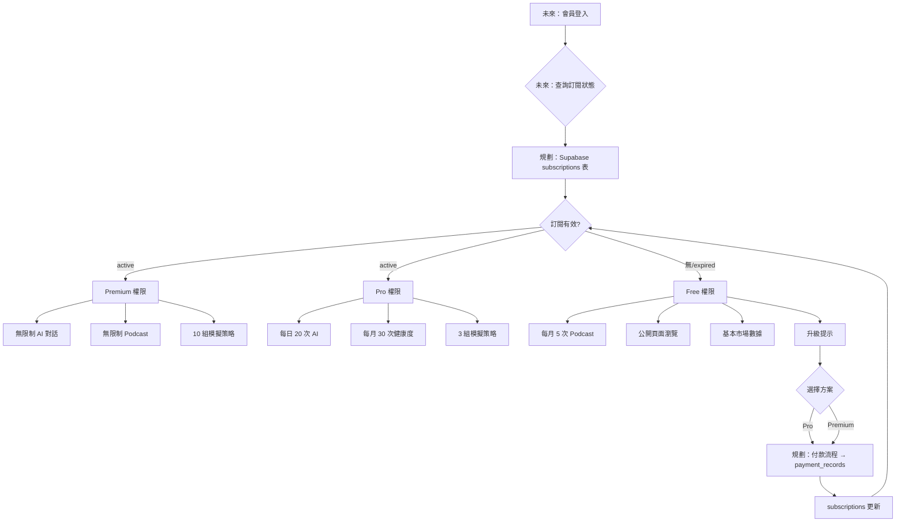
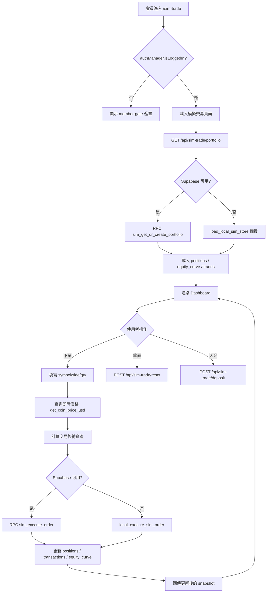
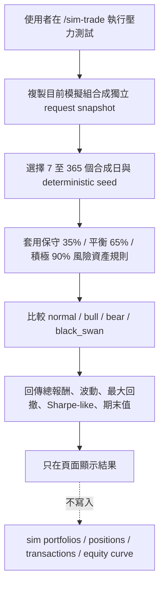
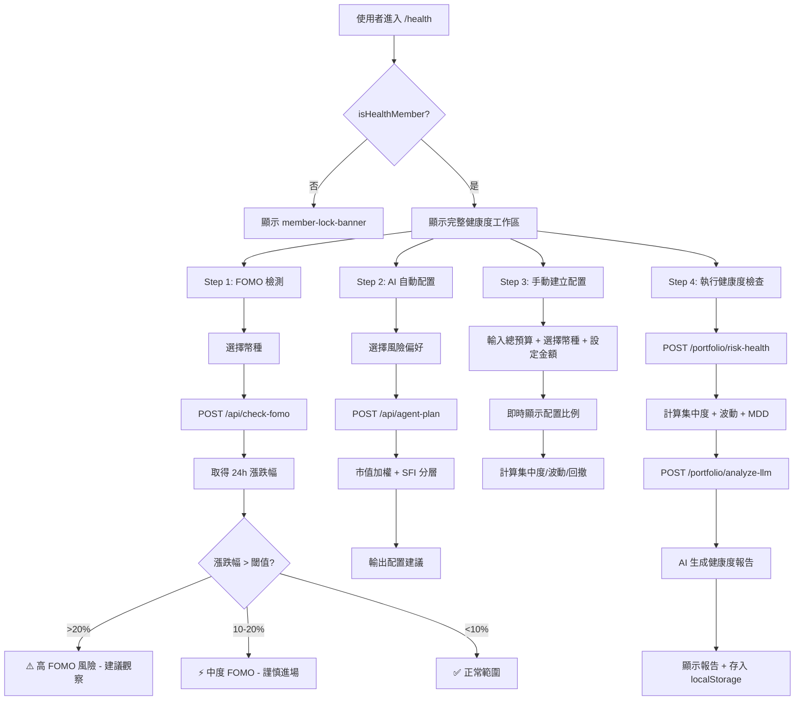
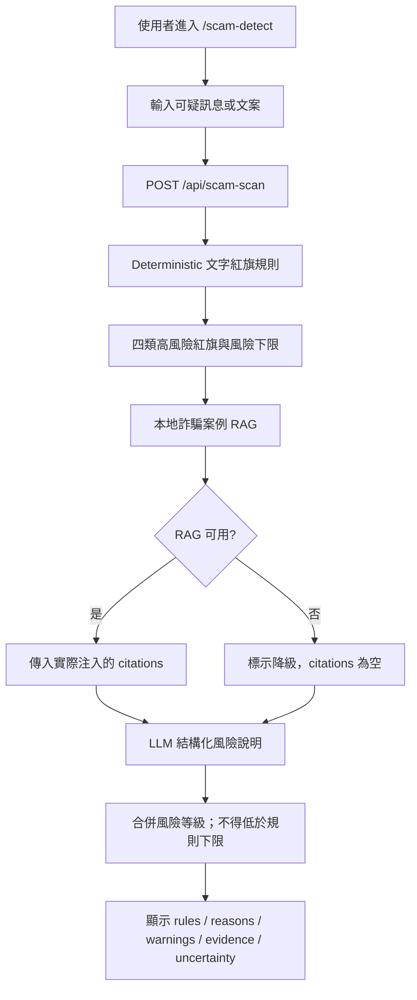
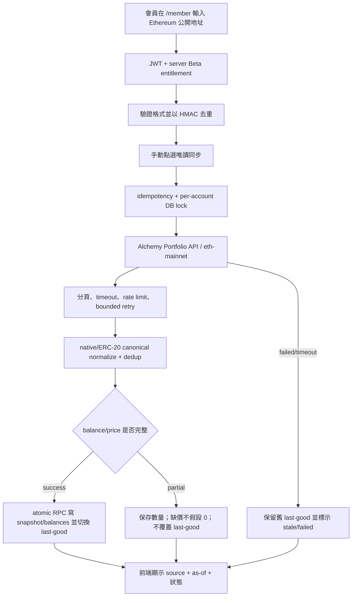

# 第 13 章 系統流程總覽

> 本章彙整系統所有關鍵流程圖，涵蓋登入、會員、交易、風險分析、詐騙檢測、AI Agent 與外部同步。

## 13-1 登入與註冊流程

```mermaid
flowchart TD
    A[使用者進入網站] --> B{已有帳號?}
    B -->|否| C[點選註冊]
    B -->|是| D[點選登入]
    
    C --> C1[填寫 Email + 密碼]
    C1 --> C2[Supabase Auth signUp]
    C2 --> C3{註冊成功?}
    C3 -->|是| C4[寫入 user_profiles]
    C3 -->|否| C5[顯示錯誤訊息]
    C4 --> D
    
    D --> D1{登入方式}
    D1 -->|Email| D2[輸入 Email + 密碼]
    D1 -->|Google| D3[OAuth Redirect]
    D1 -->|Demo 測試| D4[test@smartinvest.local]
    
    D2 --> D5{驗證}
    D3 --> D6{Google 回調}
    D4 --> D7[localStorage 標記 + buildDemoSession]
    
    D5 -->|成功| D8[取得 JWT Token]
    D5 -->|失敗| D9[顯示錯誤]
    D6 -->|成功| D8
    D6 -->|失敗| D9
    D7 --> D8
    
    D8 --> E[更新 UI: setAuthUiBySession]
    E --> F[發布 smartinvest:auth-state 事件]
    F --> G[各頁面 JS 解除鎖定]
```

**對應檔案**：`static/js/auth.js` 的 session/OAuth/Demo helpers

---

## 13-2 會員訂閱與權限流程（規劃，未實作）



> **MVP 現狀**：訂閱系統目前只是文件設計。Demo Member（`test@smartinvest.local`）只用於功能體驗與本地模擬資料，不會查詢方案、扣款、執行額度或證明 Premium entitlement。repository 也沒有 subscriptions/plans/payments migration、checkout 或 webhook route。

---

## 13-3 模擬交易完整流程



**對應檔案**：`app.py` 的 `/api/sim-trade/**`、`supabase_client.py` 的 `sim_*`、`static/js/sim_trade.js`

---

## 13-3-1 模擬組合情境壓力測試



> 這是固定參數與 seed 的假設式壓力測試，不讀取歷史 K 線，也不代表價格預測或投資建議。快照由前端當下顯示的模擬組合建立；服務不把情境價格或結果寫回模擬交易帳本。

**對應檔案**：`services/paper_stress_service.py`、`app.py` 的 `/api/paper-stress-test`、`static/js/sim_trade.js`

---

## 13-4 風險分析完整流程（健康度檢查）



**對應檔案**：`app.py` 的 `calculate_portfolio_risk_health`、`/portfolio/risk-health`、`/portfolio/analyze-llm`，以及 `static/js/health.js`

---

## 13-5 詐騙檢測流程



**對應檔案**：`app.py` 的 `_evaluate_scam_text_rules`、`_build_scam_business`、`/api/scam-scan`，以及 `static/js/scam_detect.js`

> 現行系統不會執行 GMGN、WHOIS、PTT 或鏈上掃描，結果只能用於可疑文案風險提示。

---

## 13-6 AI Agent 流程

```mermaid
flowchart TD
    A[會員進入 /agent] --> B[輸入自然語言指令]
    B --> C[/api/agent-plan]
    
    C --> D[解析使用者意圖]
    D --> E{意圖類型}
    
    E -->|建立配置| F1[取得風險偏好]
    E -->|市場分析| F2[查詢 SFI + 情緒]
    E -->|自動下單| F3[/api/agent-auto-order]
    
    F1 --> G[build_agent_allocation]
    G --> G1[篩選幣種]
    G1 --> G2[SFI 分層]
    G2 --> G3[市值加權]
    G3 --> G4[上限檢查]
    G4 --> H[輸出配置計畫]
    
    F2 --> I[整合 SFI + 情緒 + 新聞]
    I --> J[GPT 生成分析報告]
    
    F3 --> K[解析幣種/方向/金額]
    K --> L[呼叫 execute_sim_order]
    L --> M[回傳交易結果]
    
    H --> N[前端顯示配置視覺化]
    J --> O[前端顯示分析報告]
    M --> P[更新模擬交易 Dashboard]
    
    N --> Q{使用者接受?}
    Q -->|是| F3
    Q -->|調整| B
```

**對應檔案**：`app.py` 的 `build_agent_allocation`、`/api/agent-plan`、`/api/agent-auto-order`，以及 `static/js/agent.js`

---

## 13-7 外部資產同步

### 13-7-1 MVP 現狀（透明揭露）

> **目前有限 MVP**：已有 Alchemy Portfolio API + Ethereum Mainnet 公開地址的唯讀 connect/sync/portfolio/disconnect 路徑與 repo migration。功能以 server-side Beta flag 授權，Demo 拒絕；未執行正式 DB migration，也沒有自動 scheduler。paper-trading 持倉仍保持獨立。

### 13-7-2 公開錢包唯讀 MVP 流程



### 13-7-3 同步風險說明

| 風險 | 說明 | 緩解措施 |
|------|------|---------|
| Alchemy API key 洩漏 | provider key 放在 server URL，raw exception 可能包含 URL | 只從 server env 讀取；不寫 DB/log/response；固定錯誤碼 |
| rate limit/逾時 | provider 可回 429、5xx 或連線逾時 | per-request timeout、每秒上限、最多 3 次 bounded backoff |
| 分頁/單幣異常 | 未讀完 pageKey 或 metadata 不合法會少算 | 最多 10 頁、重複 pageKey fail closed、fetched/normalized counts 不同時標 partial |
| 缺少 USD 價格 | 有 token quantity 但來源無價格 | 保留 quantity，price/value/total 保持 NULL，不假設 0 |
| 新快照失敗 | 網路或寫入中斷 | 只有 atomic RPC 完整成功才切換 last-good；失敗保留舊快照 |
| 公開地址關聯身分 | 鏈上公開不等於可公開平台 user 對應 | RLS own-read、service-role write、API 只回傳遮罩地址 |

> **提醒**：現行 MVP 不接收使用者 API Key，只使用平台的 Alchemy provider key 查公開地址。未來交易所 Phase 2 必須另做憑證威脅模型，不能沿用公開地址契約存 secret。

> 本節 Mermaid 是 Task 10 repository 資料流；實際部署仍須先在 Supabase test project 執行 migration/RLS 整合測試，並設定 `ASSET_SYNC_ENABLED`、`ASSET_SYNC_HMAC_SECRET`、`ALCHEMY_API_KEY` 與 explicit service-role credential。

---

## 13-8 Podcast 生成與 TTS 流程

```mermaid
flowchart TD
    A[使用者進入 /podcast] --> B{已登入或訪客模式?}
    B -->|否| C[顯示訪客模式啟用按鈕]
    B -->|是| D[選擇節目主題]
    
    C --> C1[點選啟用訪客模式]
    C1 --> D
    
    D --> E[點選生成]
    E --> F[POST /podcast/generate]
    
    F --> G[OPENAI_MODEL 生成雙人對話稿<br/>預設 gpt-5.4]
    G --> G1[角色設定: Nova 活潑主持 + Onyx 理性分析]
    G1 --> G2[根據主題決定內容方向]
    G2 --> H[輸出結構化對話稿: {script, segments, timestamps}]
    
    H --> I[POST /podcast/tts]
    I --> J{OPENAI_API_KEY 是否設定?}
    J -->|是| K[OPENAI_TTS_MODEL 語音合成<br/>預設 gpt-4o-mini-tts]
    J -->|否| L[回傳提示: 請設定 API key]
    
    K --> K1[Nova 用 alloy 聲音]
    K --> K2[Onyx 用 onyx 聲音]
    K1 & K2 --> M[輸出音訊 URL]
    
    M --> N[前端播放音訊 + 泡泡同步]
    L --> O[前端 fallback: Web Speech API]
    O --> P[瀏覽器語音合成播放]
```

**對應檔案**：`app.py` 的 `generate_podcast`、`podcast_tts` 與 aliases，以及 `static/js/podcast.js`

---

## 13-9 爬蟲資料流（社群情緒 + 敘事雷達）

```mermaid
flowchart TD
    A[定時觸發或使用者請求] --> B{資料來源}
    
    B -->|PTT| C[SocialMediaEngine.scrape_ptt]
    B -->|RSS| D[SocialMediaEngine.scrape_rss_for_signals]
    
    C --> C1[爬取 DigiCurrency 板]
    C1 --> C2[解析 HTML: 標題/作者/推文數/內文]
    C2 --> C3[過濾: 去廣告/刪除文/低品質]
    C3 --> C4[去重: URL 唯一鍵]
    C4 --> E[PTT 文章列表]
    
    D --> D1[feedparser 解析 RSS]
    D1 --> D2[過濾: 去廣告/PR/不相關]
    D2 --> D3[敘事分類: 關鍵字匹配]
    D3 --> F[新聞信號列表]
    
    E --> G[/api/social-data]
    F --> G
    F --> H[/api/narratives]
    
    G --> I[前端社群情緒頁面]
    H --> J[前端敘事雷達頁面]
```

**對應檔案**：`app.py` 的 `SocialMediaEngine`，以及 `static/js/social_sentiment.js`, `static/js/narrative_radar.js`

---

> 所有流程圖中的步驟、API 端點、函式名稱皆與實際程式碼 (`app.py`、`supabase_client.py`、`static/js/*.js`) 一致。
