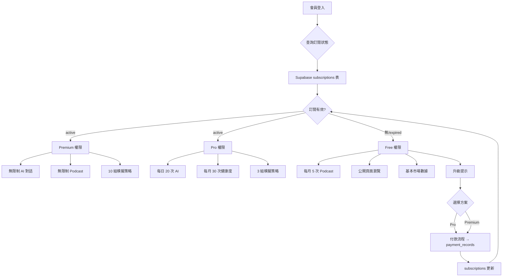
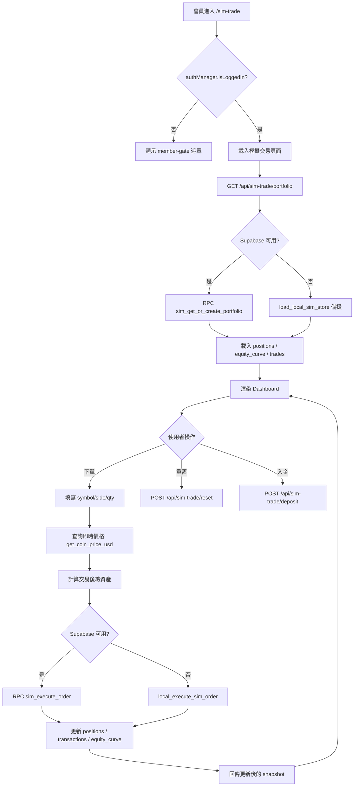
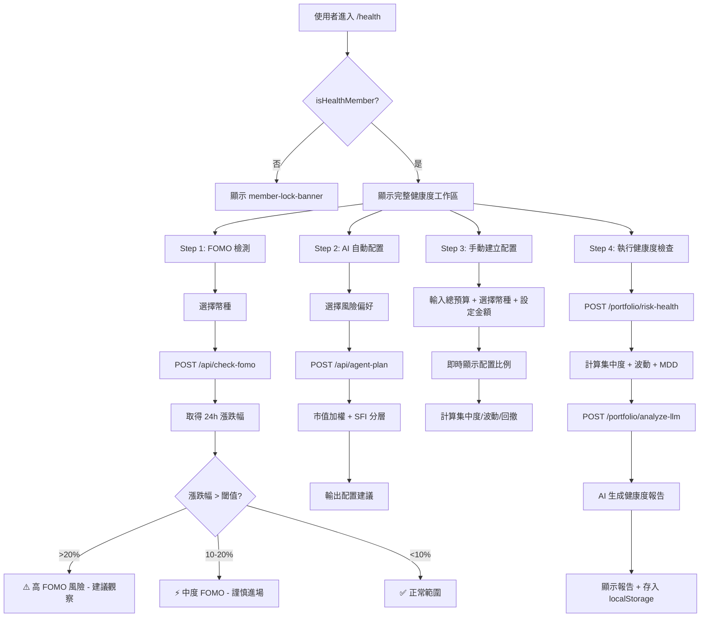
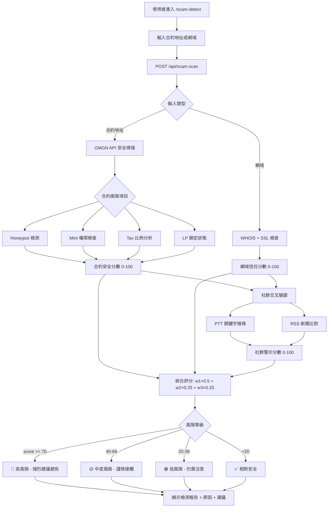
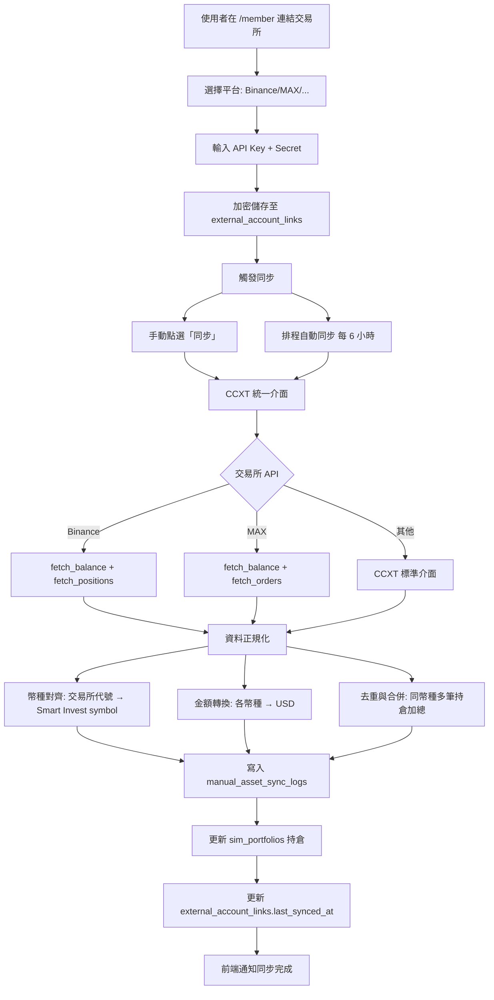

# 第 13 章 系統流程總覽

> 本章彙整系統所有關鍵流程圖，涵蓋登入、會員、交易、風險分析、詐騙檢測、AI Agent 與外部同步。

## 13-1 登入與註冊流程

```mermaid
flowchart TD
    A[使用者進入網站] --> B{已有帳號?}
    B -->|否| C[點選註冊]
    B -->|是| D[點選登入]
    
    C --> C1[填寫 Email + 密碼]
    C1 --> C2[Supabase Auth signUp]
    C2 --> C3{註冊成功?}
    C3 -->|是| C4[寫入 user_profiles]
    C3 -->|否| C5[顯示錯誤訊息]
    C4 --> D
    
    D --> D1{登入方式}
    D1 -->|Email| D2[輸入 Email + 密碼]
    D1 -->|Google| D3[OAuth Redirect]
    D1 -->|Demo 測試| D4[test@smartinvest.local]
    
    D2 --> D5{驗證}
    D3 --> D6{Google 回調}
    D4 --> D7[localStorage 標記 + buildDemoSession]
    
    D5 -->|成功| D8[取得 JWT Token]
    D5 -->|失敗| D9[顯示錯誤]
    D6 -->|成功| D8
    D6 -->|失敗| D9
    D7 --> D8
    
    D8 --> E[更新 UI: setAuthUiBySession]
    E --> F[發布 smartinvest:auth-state 事件]
    F --> G[各頁面 JS 解除鎖定]
```

**對應檔案**：`static/js/auth.js` (L132–L455)

---

## 13-2 會員訂閱與權限流程



> **MVP 現狀**：訂閱系統目前為文件設計層級。MVP 使用 Demo Member 模式（`test@smartinvest.local`）模擬完整會員權限。實際金流與訂閱管理待 Phase 2 實作。

---

## 13-3 模擬交易完整流程



**對應檔案**：`app.py` L1892–L2030, `static/js/sim_trade.js`

---

## 13-4 風險分析完整流程（健康度檢查）



**對應檔案**：`app.py` L2316–L2363, `static/js/health.js`

---

## 13-5 詐騙檢測流程



**對應檔案**：`app.py` L2160–L2188, `static/js/scam_detect.js`

---

## 13-6 AI Agent 流程

```mermaid
flowchart TD
    A[會員進入 /agent] --> B[輸入自然語言指令]
    B --> C[/api/agent-plan]
    
    C --> D[解析使用者意圖]
    D --> E{意圖類型}
    
    E -->|建立配置| F1[取得風險偏好]
    E -->|市場分析| F2[查詢 SFI + 情緒]
    E -->|自動下單| F3[/api/agent-auto-order]
    
    F1 --> G[build_agent_allocation]
    G --> G1[篩選幣種]
    G1 --> G2[SFI 分層]
    G2 --> G3[市值加權]
    G3 --> G4[上限檢查]
    G4 --> H[輸出配置計畫]
    
    F2 --> I[整合 SFI + 情緒 + 新聞]
    I --> J[GPT 生成分析報告]
    
    F3 --> K[解析幣種/方向/金額]
    K --> L[呼叫 execute_sim_order]
    L --> M[回傳交易結果]
    
    H --> N[前端顯示配置視覺化]
    J --> O[前端顯示分析報告]
    M --> P[更新模擬交易 Dashboard]
    
    N --> Q{使用者接受?}
    Q -->|是| F3
    Q -->|調整| B
```

**對應檔案**：`app.py` L2031–L2106, `static/js/agent.js`

---

## 13-7 外部平台交易同步方案（未來 Phase 2）

### 13-7-1 MVP 現狀（透明揭露）

> **目前 MVP 為完全手動模式**。使用者在模擬交易頁面手動輸入買入/賣出，系統不會自動讀取任何真實交易所的持倉或交易紀錄。

### 13-7-2 未來自動同步流程（Phase 2 設計）



### 13-7-3 同步風險說明

| 風險 | 說明 | 緩解措施 |
|------|------|---------|
| API Key 洩漏 | 若伺服器被入侵，API key 可能外流 | 加密儲存 (pgcrypto)、僅限讀取權限、IP 白名單 |
| 同步延遲 | 交易所 API 有 rate limit | 最小同步間隔 5 分鐘、錯誤重試 |
| 資料不一致 | 交易所回傳格式可能變更 | CCXT 抽象層統一處理、異常時保留上次快照 |
| 費率計算 | 不同交易所手續費結構不同 | 使用者手動輸入手續費率 |
| 餘額 ≠ 可交易 | 部分餘額可能在委託中 | 分開顯示可用餘額與總餘額 |

> **提醒**：Phase 2 實作時，應使用**唯讀 API Key**，並明確告知使用者系統只會讀取資料，不會執行真實交易。

---

## 13-8 Podcast 生成與 TTS 流程

```mermaid
flowchart TD
    A[使用者進入 /podcast] --> B{已登入或訪客模式?}
    B -->|否| C[顯示訪客模式啟用按鈕]
    B -->|是| D[選擇節目主題]
    
    C --> C1[點選啟用訪客模式]
    C1 --> D
    
    D --> E[點選生成]
    E --> F[POST /podcast/generate]
    
    F --> G[GPT-4o-mini 生成雙人對話稿]
    G --> G1[角色設定: Nova 活潑主持 + Onyx 理性分析]
    G1 --> G2[根據主題決定內容方向]
    G2 --> H[輸出結構化對話稿: {script, segments, timestamps}]
    
    H --> I[POST /podcast/tts]
    I --> J{OPENAI_API_KEY 是否設定?}
    J -->|是| K[OpenAI TTS-1 語音合成]
    J -->|否| L[回傳提示: 請設定 API key]
    
    K --> K1[Nova 用 alloy 聲音]
    K --> K2[Onyx 用 onyx 聲音]
    K1 & K2 --> M[輸出音訊 URL]
    
    M --> N[前端播放音訊 + 泡泡同步]
    L --> O[前端 fallback: Web Speech API]
    O --> P[瀏覽器語音合成播放]
```

**對應檔案**：`app.py` L2191–L2311, `static/js/podcast.js`

---

## 13-9 爬蟲資料流（社群情緒 + 敘事雷達）

```mermaid
flowchart TD
    A[定時觸發或使用者請求] --> B{資料來源}
    
    B -->|PTT| C[SocialMediaEngine.scrape_ptt]
    B -->|RSS| D[SocialMediaEngine.scrape_rss_for_signals]
    
    C --> C1[爬取 DigiCurrency 板]
    C1 --> C2[解析 HTML: 標題/作者/推文數/內文]
    C2 --> C3[過濾: 去廣告/刪除文/低品質]
    C3 --> C4[去重: URL 唯一鍵]
    C4 --> E[PTT 文章列表]
    
    D --> D1[feedparser 解析 RSS]
    D1 --> D2[過濾: 去廣告/PR/不相關]
    D2 --> D3[敘事分類: 關鍵字匹配]
    D3 --> F[新聞信號列表]
    
    E --> G[/api/social-data]
    F --> G
    F --> H[/api/narratives]
    
    G --> I[前端社群情緒頁面]
    H --> J[前端敘事雷達頁面]
```

**對應檔案**：`app.py` L700–L880, `static/js/social_sentiment.js`, `static/js/narrative_radar.js`

---

> 所有流程圖中的步驟、API 端點、函式名稱皆與實際程式碼 (`app.py`、`supabase_client.py`、`static/js/*.js`) 一致。
