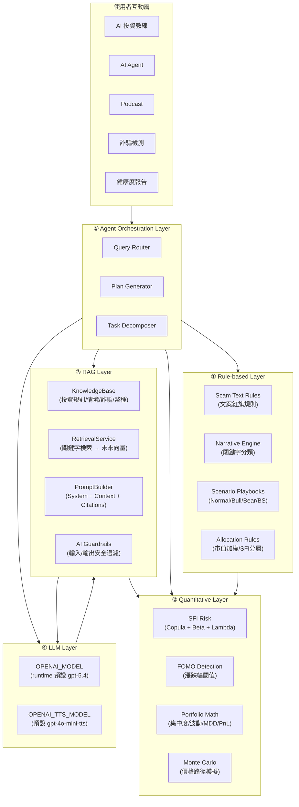

# 第 15 章 AI 系統總架構

> Smart Invest Crypto 採用 **Hybrid AI Architecture**，規則、量化、RAG、LLM、協調、評測與使用者情境分層協作，而非單一 LLM。

## 15-1 架構總覽



## 15-2 各層詳細說明

### ① Rule-based Layer — 規則層

| 模組 | 位置 | 說明 |
|------|------|------|
| Scam Text Rules | `app.py` `_evaluate_scam_text_rules()` | 文案紅旗：保證獲利、助記詞／私鑰、冒名客服、緊急轉帳與提示注入；不執行 GMGN/WHOIS/PTT/鏈上掃描 |
| Narrative Engine | `app.py` `Config.NARRATIVES` + `SocialMediaEngine.fetch_narratives_full()` | RSS 關鍵字匹配，自動分類 7 大敘事 |
| Scenario Playbooks | `data/knowledge/scenario_playbooks.md` + `Config.MARKET_SCENARIOS` | 四種市場情境的應對策略 |
| Allocation Rules | `app.py` `build_agent_allocation()` | 市值加權 + SFI 分層 + 單幣上限 |

**設計原則**：所有 deterministic、可列舉規則的邏輯都留在這一層，不經 LLM。

### ② Quantitative Layer — 量化層

| 模組 | 位置 | 說明 |
|------|------|------|
| SFI Risk | `app.py` `RiskModel.calculate_copula_risk()` | Copula 尾部相關 + Beta + Lambda，範圍 0–100 |
| FOMO Detection | `app.py` `/api/check-fomo` | 24h 漲跌幅閾值判斷，>20% 警報 |
| Portfolio Math | `app.py` `calculate_portfolio_risk_health()` | 集中度、年化波動、最大回撤 |
| Monte Carlo | `app.py` `MonteCarloEngine.simulate_price_paths()` | 100 條價格路徑模擬，95% VaR |

**設計原則**：所有數學公式、數值計算留在這一層，LLM 只能讀取結果做解釋，不能修改數值。

### ③ RAG Layer — 檢索增強層（Phase 2A 升級完成）

| 模組 | 位置 | 說明 |
|------|------|------|
| KnowledgeBase | `services/knowledge_base.py` | 載入知識檔案 + 支援 index rebuild metadata |
| ChunkingService | `services/chunking_service.py` | **新增** 語意分割（H1/H2/H3 + 段落 + 列表 + JSON per-record） |
| EmbeddingService | `services/embedding_service.py` | **新增** text-embedding-3-small + hash cache + fallback |
| VectorStoreService | `services/vector_store_service.py` | **新增** ChromaDB persistent store + rebuild + query |
| BM25Service | `services/bm25_service.py` | **新增** BM25 + jieba + TF-IDF fallback |
| RetrievalService | `services/retrieval_service.py` | **升級** Hybrid retrieval（BM25 + dense + RRF + rerank + keyword fallback） |
| QueryRewriteService | `services/query_rewrite_service.py` | **新增** Rule expansion + similarity guard |
| QueryRouterService | `services/query_router_service.py` | **新增** Fast/Deep path routing |
| RerankerService | `services/reranker_service.py` | **新增** Lightweight reranker（可插拔，預留 cross-encoder） |
| PromptBuilder | `services/prompt_builder.py` | **升級** Confidence notes + fallback wording + unified citations |
| RAG Trace / Metrics | `services/rag_trace_service.py`, `services/rag_metrics_service.py` | sanitized input/answer、實際來源、status/fallback/token/latency；DB migration 尚未部署 |
| AI Guardrails | `services/ai_guardrails.py` | 禁止保證獲利/報明牌/槓桿/prompt injection |

**設計原則**：RAG 只做知識補充，不做決策。檢索失敗時完全 fallback，不影響既有功能。所有新組件皆有 graceful degradation。

### ④ LLM Layer — 語言模型層

| 模組 | 模型 | 用途 |
|------|------|------|
| AI Chat | `OPENAI_MODEL`（預設 `gpt-5.4`） | 對話式風險教育與 tool calling |
| Agent Plan | `OPENAI_MODEL_AGENT`（預設 `gpt-5.4`） | 任務分解與配置說明 |
| Podcast Script | `OPENAI_MODEL`（預設 `gpt-5.4`） | 雙人對話稿生成 |
| Scam Analysis | `OPENAI_MODEL`（預設 `gpt-5.4`） | 可疑文案風險說明；固定規則另在 Rule layer |
| Health Narrative | `OPENAI_MODEL_PORTFOLIO`（預設 `gpt-5.4`） | 健康度數值白話解讀 |
| Query Rewrite | `gpt-4o-mini` 預設 | 檢索 query 改寫；失敗使用原 query |
| TTS | `OPENAI_TTS_MODEL`（預設 `gpt-4o-mini-tts`） | 文字轉語音；不可用時前端瀏覽器 TTS fallback |

**設計原則**：LLM 只用於需要語言理解/生成的任務。所有數值計算在進入 LLM 前已完成。

### ⑤ Agent Orchestration Layer — 代理協調層

| 模組 | 位置 | 說明 |
|------|------|------|
| Query Router | `services/rag_service.py` → `_retrieve_for_endpoint()` | 根據 endpoint/query 選擇 fast/deep 路徑與知識主題 |
| Plan Generator | `app.py` `api_agent_plan()` | 任務 → 行動計畫 → 配置建議 |
| Task Decomposer | `app.py` `api_agent_plan()` prompt | 將模糊目標拆成可執行步驟 |

**設計原則**：Agent 負責協調 Rule + Quant + RAG + LLM 四層，不自己做數值計算。

### ⑥ Evaluation / Backtesting Layer

| 模組 | 位置 | 說明 |
|------|------|------|
| RAG 離線評測 | `eval/README.md`, `scripts/eval_rag.py` | 15 題 pending human review；retrieval metrics/artifacts/baseline gate，不宣稱準確率 |
| 情境壓力測試 | `services/paper_stress_service.py` | 固定 seed 的 synthetic scenario；不是歷史回測，不寫 paper ledger |
| 歷史回測方法 | `docs/12` §12-7 | 滾動視窗法與 Sharpe/MDD/Calmar 只完成設計，runtime 未實作 |
| ML 評估 | `models/README.md` | 各 ML 模型的評估指標與格式 |

### ⑦ User Context Layer

| 模組 | 說明 |
|------|------|
| 風險偏好 | 保守/穩健/積極，影響所有 AI 建議的基調 |
| 持倉摘要 | 由 Agent/Podcast/Health 等指定 request context 提供；不宣稱所有 Chat 都自動讀取帳本 |
| 歷史對話 | 從 Supabase ai_messages 載入，維持對話連貫性 |
| 市場情境 | `/sim-trade` 可用固定 seed 執行三策略／四情境 synthetic stress；regime detection 仍為規劃 |

---

## 15-3 資料流總圖

```
使用者輸入
    │
    ▼
Query Router ──→ 判斷查詢類型
    │
    ├──→ Rule Layer: 規則判斷（詐騙/敘事/情境）
    ├──→ Quant Layer: 數值計算（SFI/FOMO/Portfolio Math）
    ├──→ RAG Layer: 知識檢索（投資原則/情境/風格指南）
    │         │
    │         ▼
    │    Prompt Builder ──→ 組裝 augmented prompt
    │         │
    ▼         ▼
    LLM Layer ──→ 生成回應
    │
    ▼
Guardrails ──→ 安全過濾
    │
    ▼
使用者回應（+ citations + 免責提示）
```

---

## 15-4 技術棧

| 層級 | 技術 | 版本 |
|------|------|------|
| LLM | OpenAI `gpt-5.4` runtime defaults；query rewrite `gpt-4o-mini` | env 可覆寫，成本依實際 model/token |
| TTS | OpenAI `gpt-4o-mini-tts` default + browser fallback | API / browser |
| 知識庫 | Markdown + JSON (local fs) → Semantic chunks | Phase 2A |
| 檢索 | BM25 + Dense (text-embedding-3-small) + RRF fusion | Phase 2A |
| Vector DB | ChromaDB (persistent local) | Phase 2A |
| Reranker | Lightweight score fusion + metadata boost | Phase 2A |
| 評估 | eval_rag.py (P@K/Recall@K/MRR/NDCG) | Phase 2A |
| Guardrails | Regex + keyword patterns | MVP |
| 回測框架 | Rolling Window (yfinance data) | 已設計，未執行 |
| ML 框架 | scikit-learn / PyTorch (規劃中) | Phase 2 |
| 監控 | fixed-code Python logging + RAG trace contract | Sentry 尚未整合 |

---

## 15-5 設計決策記錄

| 決策 | 理由 |
|------|------|
| 不把所有東西丟給 GPT | LLM 有幻覺風險，數值/規則邏輯必須 deterministic |
| RAG 採 hybrid retrieval | BM25/dense/RRF/rerank 可依 dependency/config 降級；不能只以單一路徑宣稱品質 |
| Guardrails 在應用層而非模型層 | 模型層過濾不可控（OpenAI API 無法自訂），應用層可審計 |
| 分層設計 | 每層可獨立測試、升級與 fallback；trace/eval 專門驗證跨層輸入輸出 |
| Coin profiles 用 JSON | 結構化查詢比 Markdown 快，方便後續接 API |
