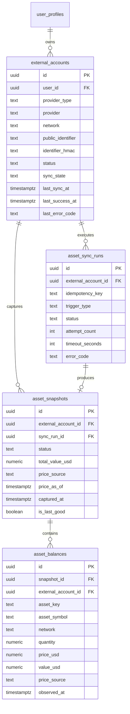

# 真實資產同步資料與 Provider 契約

## 1. 決策門

```text
APPROVED_PROVIDER: Alchemy Portfolio API
APPROVED_NETWORK: Ethereum Mainnet (eth-mainnet)
PROVIDER_DECISION_REVIEWED: 2026-08-20
```

Task 09 實作期間保持 provider-neutral 且兩個決策值為 `TBD`。Codex 審核 PASS 後，依 2026-08-20 的 Alchemy 官方文件核准上述單一 provider/network，才解鎖 Task 10。

### 1.1 決策理由與邊界

- 選 Alchemy Portfolio API `assets/tokens/by-address`：官方 endpoint 一次回傳 Ethereum 公開地址的 native/ERC-20 balance、metadata 與價格，並明確定義 top-level `partialErrors` 與 per-token error，可直接對應 Task 09 的 success/partial 契約。
- MVP 只核准 `eth-mainnet`，不因 provider 宣稱支援多鏈就對外說成「全鏈」。
- 只呼叫 read-only portfolio endpoint；不呼叫 transfer、sign、send transaction、bundler 或 exchange API。
- `ALCHEMY_API_KEY` 只存 server environment，是平台 provider credential，不是使用者錢包 secret，不寫 DB/log/response。沒有 key 時 adapter 必須 fail closed。
- 官方資料顯示該 endpoint 每次 360 CU；Task 10 仍依本契約做 timeout、bounded retry 與 local/shared rate limit，不假設配額永不改變。

官方證據：

- https://www.alchemy.com/docs/data/portfolio-apis/portfolio-api-endpoints/portfolio-api-endpoints/get-tokens-by-address
- https://www.alchemy.com/docs/reference/compute-unit-costs

## 2. 範圍與資料分離

| 來源 | 定義 | 儲存邊界 |
|---|---|---|
| `real` | 從已核准唯讀 provider 取得的錢包/外部資產 | 只能寫 `external_accounts` / `asset_sync_runs` / `asset_snapshots` / `asset_balances` |
| `manual` | 使用者自行申報的真實資產 | 未來獨立契約；不寫 Task 09 real tables，也不寫 sim tables |
| `simulated` | paper trading 現金、持倉、交易與權益曲線 | 繼續使用 `sim_*` / local JSON，不與 real snapshot merge/update |

Task 09 migration 在三張資產資料表上將 `source_kind` 限制為 `real`，且沒有任何 `sim_*` FK。

## 3. ERD



## 4. 表級契約

### 4.1 `external_accounts`

- 所有權：`user_id` 必須是 Supabase Auth UID；帳號刪除時 cascade 清除高敏錢包關聯與快照。
- 本階段限制：`source_kind=real`、`provider_type=wallet`、`credential_reference IS NULL`。
- `public_identifier`：為呼叫公開鏈資料所必需的地址；雖可在鏈上公開查詢，與本平台 user 關聯後仍視為個資。
- `identifier_hmac`：使用 server secret 做 keyed HMAC-SHA-256，用於去重；secret 不存 DB/log/repo/client。
- `status`：`active` 才可同步；`disconnected` 停止新同步；`disabled` 為系統/管理禁用。
- `sync_state`：只是最後一次狀態摘要，詳細歷史以 `asset_sync_runs` 為準。
- `last_error_code`：只存固定 allowlisted code，不存 raw exception/provider payload/address。

### 4.2 `asset_sync_runs`

- `(external_account_id, idempotency_key)` 唯一；相同同步請求重試時回用原 run，不建第二筆。
- partial unique index 保證每個 account 最多一筆 `queued/running`；取鎖衝突回 `sync_in_progress`。
- status 只能 `queued -> running -> success|partial|failed|stale`，或 `queued -> failed`。終態不反向變更。
- `fetched/normalized/persisted_count` 用於解釋 partial；不保存 raw response。

### 4.3 `asset_snapshots`

- 快照為 immutable normalized result；一個 run 最多一筆。
- 每個 account 最多一筆 `is_last_good=true`。新快照成功時，同一 DB transaction 內先寫完 snapshot/balances、驗證 counts，再切換 last-good pointer。
- `failed/stale` run 不建新 last-good snapshot；前一筆仍可讀並在 UI 標示 stale/error。
- `partial` 快照預設不取代 last-good；只有 adapter 提供明確 completeness policy 且記錄原因時可接受。

### 4.4 `asset_balances`

- 每筆必須同時屬於相同 account 的 snapshot，由 composite FK 防止跨帳號串接。
- `asset_key` 由 adapter 決定 canonical identity（例如 `eip155:1/native:ETH` 或 `eip155:1/erc20:0x...`），不只依賴可重複的 symbol。
- quantity 使用 `numeric(38,18)` 且不可負數；不用 binary float 當 DB 真值。
- 沒有估價時 `price_usd/value_usd/price_source/price_as_of` 為 NULL，不得自動填 0 製造假總資產。

## 5. Provider interface

`services/asset_sync_provider.py` 只有類型與抽象方法，不匯入 HTTP/RPC SDK、不建立客戶端、不發網路請求。

| Method | 輸入 | 輸出 | 邊界 |
|---|---|---|---|
| `validate_account()` | user-owned `ExternalAccountRef` | canonical identifier 或 fixed error code | 只驗證格式/支援網路，不接收私鑰 |
| `fetch_balances()` | validated account + timeout | provider-native balance DTOs | 必須 read-only；不得呼叫 transfer/trade/sign |
| `normalize_balances()` | native DTOs | deterministic `NormalizedBalance[]` | 不存 raw response；拒絕負數/無 identity/無 timezone |
| `health_check()` | timeout | fixed-code availability | 不回 raw exception、URL、token 或 address |

## 6. 編排、進度與失敗語意

```mermaid
stateDiagram-v2
    [*] --> queued
    queued --> running
    queued --> failed: validation/entitlement/lock setup failure
    running --> success: all normalized balances committed
    running --> partial: bounded subset committed with explicit reason
    running --> failed: no acceptable snapshot
    running --> stale: provider unavailable; last-good kept
    success --> [*]
    partial --> [*]
    failed --> [*]
    stale --> [*]
```

### 6.1 建議執行順序

1. 驗證 Supabase JWT，取 server-side `user_id`；不接受 body user id。
2. `EntitlementChecker.check(user_id, "asset_sync")`；checker 不可用時 fail closed，Demo/email/client plan 不能升權。
3. 查 account ownership/status/provider/network；`TBD` 未移除時拒絕啟動。
4. 以 account + trigger + UTC time bucket 生成 idempotency key，插入 `queued` run 並取 DB lock。
5. 依 `SyncPolicy` 呼叫 provider：timeout 10s/次、單個 process 每秒最多 2 個 provider requests、最多 3 次、backoff 1s -> 2s -> 4s（可加 bounded jitter，上限 8s）。分散式部署時仍必須以 shared limiter 與 provider quota 為準，不能只依賴 process-local 計數。
6. 只對 timeout、429、5xx/短暫 network failure 重試；格式無效、401/403、unsupported network 不重試。
7. normalize -> validate counts -> transaction 寫 snapshot + balances -> 切換 last-good -> 更新 account/run。
8. 鎖定時間超過 `timeout * attempts + backoff budget` 時由 recovery job 以固定碼收旂，不直接刪 run。

### 6.2 狀態語意

| 狀態 | 語意 | last-good |
|---|---|---|
| `success` | provider 回應、normalize、儲存與估價策略均通過 | 原子切換到新快照 |
| `partial` | 只有部分可支援資產/價格，counts 與 fixed reason 可解釋 | 預設保留舊快照 |
| `failed` | 無可接受新快照 | 保留 |
| `stale` | 未能取得新資料，舊快照超過 24h | 保留並必須顯示 as-of/stale |

## 7. Disconnect 與刪除

- Disconnect 不允許新 run，先取消尚未執行的 scheduled job，再將 account 設 `disconnected`/`disconnected_at`。
- 現正 running 的作業應檢查 status fence；disconnect 後不得切換 last-good。
- 預設保留已有 normalized snapshots 供使用者查看，但顯示 disconnected + as-of；使用者選擇「刪除連結與資料」時才 delete account，FK cascade 清除 runs/snapshots/balances。
- 帳號刪除時 `user_profiles.user_id -> external_accounts` cascade，不留可重新連結到身分的公開地址。

## 8. 權限與敏感性

| 對象 | authenticated | service role | anon |
|---|---|---|---|
| `external_accounts` | 只 SELECT 自己 | 經 server ownership + entitlement 後寫入 | 無權限 |
| `asset_sync_runs` | 只 SELECT 自己 account 的 runs | orchestrator 寫入 | 無權限 |
| `asset_snapshots` | 只 SELECT 自己 account 的 snapshots | orchestrator transaction 寫入 | 無權限 |
| `asset_balances` | 只 SELECT 自己 account 的 balances | orchestrator transaction 寫入 | 無權限 |

- 不存助記詞、私鑰、API key/secret、Bearer token、raw provider payload。
- `credential_reference` 只是未來 vault pointer 預留欄；Task 09 DB constraint 強制 NULL。
- 記錄中只允許 fixed error code，不帶 exception text、public identifier 或 user input。

## 9. Entitlement abstraction

- 功能鍵固定為 `asset_sync`，由 server-side `AssetSyncEntitlementChecker` 解析。
- 目前 subscriptions/plans 只是 planned schema，因此預設 `DenyByDefaultEntitlementChecker` 回 `entitlement_backend_unavailable`，不把 Demo、email domain、client-supplied plan 當付費證據。
- 未來整合可查 `subscriptions -> membership_plans.features_json.asset_sync`，但不在本 migration 建 FK，避免依賴尚未存在的表。

## 10. 部署前關卡

1. Codex 明確核准 provider/network，替換兩個 TBD。
2. 以測試專案執行 migration，比對 `user_profiles.user_id` 型別與既有 grants。
3. 做 RLS integration：user A/B、anon、service role、帳號刪除 cascade。
4. 驗證 partial unique indexes 在併發下阻擋重複 active run/last-good。
5. 上線 provider adapter 前另做 threat model、rate-limit 與真實 fixture contract tests。
