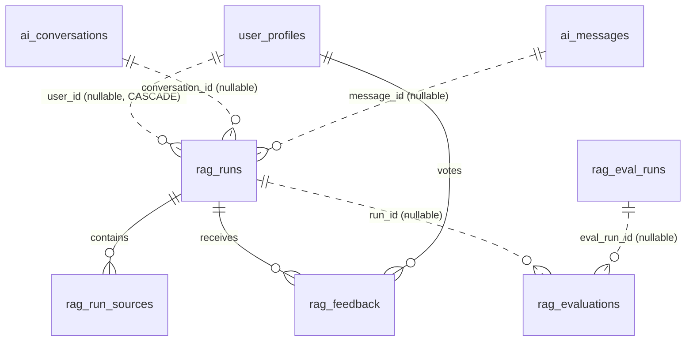

# RAG Trace 資料契約（Data Contract）

> 本文件定義「RAG 回答可追溯」的資料契約與對應 migration（`supabase/migrations/20260814120000_rag_trace.sql`）。
> 本文件只規範資料層；runtime 接線（service 寫入、endpoints、UI）由後續 Task 實作，本契約不涉及。

## 1. 目的與範圍

Phase 2A 升級後，RAG 管線（Router → Rewrite → Hybrid Retrieval → Rerank → Prompt → LLM）需要可追溯能力：
每個回答來自哪些 chunk、走了哪條路徑、品質如何、使用者怎麼評價。本契約建立 5 張新表：

| 表 | 用途 |
|---|---|
| `rag_runs` | 每次 RAG 管線執行的主紀錄（query、answer、路徑、版本、token、延遲） |
| `rag_run_sources` | 該 run 檢索到的來源 chunk（rank、score、excerpt、是否真的注入） |
| `rag_feedback` | 使用者對回答的 up/down 回饋 |
| `rag_evaluations` | 單筆評估結果（LLM judge / 人工 / heuristic），可經 `eval_run_id` 追溯到離線評測批次 |
| `rag_eval_runs` | 離線評估批次彙總（dataset/config/code 版本、整體指標） |

**範圍外（本契約刻意不做）**：
- 不定義任何 runtime endpoint、不改 `app.py`、不改現有 services、不改 UI。
- 不執行 migration、不宣稱資料已寫入正式 DB。
- 不實作 retention job（見 §6，標示 planned）。

## 2. 使用者鍵與 FK 決策

依 `docs/08-資料庫設計.md` §8-2-1：**使用者鍵是 `user_profiles.user_id`（PK），即 Supabase Auth UID（`auth.users.id`）**。
本 migration **不使用也不假定 `user_profiles.id` 存在**，所有使用者關聯一律以 `user_id UUID` 表達。

FK 目標（既有表依 docs/08 定義）：
- `rag_runs.user_id` → `user_profiles(user_id)`，nullable，**`ON DELETE CASCADE`**：帳號資料列刪除時，連帶清除該使用者的 runs（高敏感 query/answer），並由下游 FK cascade 清除 source/feedback/evaluation 關聯資料（見 §6.2）
- `rag_runs.conversation_id` → `ai_conversations(id)`，nullable，`ON DELETE SET NULL`（對話刪除不刪 trace）
- `rag_runs.message_id` → `ai_messages(id)`，nullable，`ON DELETE SET NULL`
- `rag_feedback.user_id` → `user_profiles(user_id)`，NOT NULL，`ON DELETE CASCADE`
- `rag_evaluations.eval_run_id` → `rag_eval_runs(id)`，nullable，`ON DELETE CASCADE`（刪除評測批次時同步清除該批次明細）

## 3. ER 圖



## 4. 逐表資料字典

敏感性分級：`高`（含使用者內容）、`中`（已遮罩或使用者自撰）、`低`（不可逆雜湊/知識庫內容/彙總）、`無`（系統欄位）。

寫入者/讀取者縮寫：
- `SR` = 後端 service role（`SUPABASE_SERVICE_ROLE_KEY`，僅伺服器端）
- `U` = 已認證使用者（經 RLS，僅自己資料）
- `ADMIN` = 管理員（service role 或 Supabase Dashboard SQL editor，見 §5.4）

### 4-1 `rag_runs`

| 欄位 | 型別/約束 | 用途 | 敏感性 | 寫入者 | 讀取者 | Nullable 原因 |
|---|---|---|---|---|---|---|
| `id` | uuid PK, gen_random_uuid() | 主鍵 | 無 | 系統 | SR/U/ADMIN | —（PK） |
| `trace_id` | text NOT NULL UNIQUE, 8–128 chars | 跨管線追溯 id（建議 UUIDv4/32-hex） | 低 | SR | SR/U/ADMIN | — |
| `user_id` | uuid FK→user_profiles, ON DELETE CASCADE | 觸發使用者（Auth UID）；帳號資料列刪除時連帶清除該使用者的 runs | 低 | SR | SR/U/ADMIN | 離線評估/背景執行無使用者 |
| `conversation_id` | uuid FK→ai_conversations | 對話關聯 | 低 | SR | SR/U/ADMIN | podcast/scam/health/agent 非對話型 |
| `message_id` | uuid FK→ai_messages | 訊息關聯 | 低 | SR | SR/U/ADMIN | 同上；非 chat endpoint 無 message |
| `endpoint` | text NOT NULL, CHECK 5 值 | chat/agent/podcast/scam/health | 低 | SR | SR/U/ADMIN | — |
| `sanitized_query` | text NOT NULL, ≤4000 | **遮罩後** query（原始永不入庫） | 中 | SR | SR/U/ADMIN | —（每個 run 必有 query） |
| `query_hash` | text NOT NULL, `^[0-9a-f]{64}$` | **keyed HMAC-SHA-256(server_secret, normalized sanitized query)**，供去重/相似查詢；**非匿名化保證**（見 §6.1） | 低 | SR | SR/ADMIN | — |
| `answer` | text | 最終回答（寫入前經 PII 遮罩） | 高 | SR | SR/U（僅自己）/ADMIN | 失敗或 abstain 時無回答 |
| `model` | text NOT NULL, ≤100 | LLM 模型（gpt-4o-mini…） | 無 | SR | SR/U/ADMIN | — |
| `prompt_version` | text | prompt 模板版本 | 無 | SR | SR/ADMIN | 版本追蹤未實作（planned） |
| `kb_version` | text | 知識庫版本 | 無 | SR | SR/ADMIN | 同上（planned） |
| `index_version` | text | 檢索索引版本 | 無 | SR | SR/ADMIN | 同上（planned） |
| `config_version` | text | 管線設定版本 | 無 | SR | SR/ADMIN | 同上（planned） |
| `route` | text, CHECK fast/deep/unknown | 路由決策；`unknown`＝router 不可用 | 無 | SR | SR/U/ADMIN | router 未啟用或失敗 |
| `confidence` | numeric(5,2), 0–1 | 信心分數 | 無 | SR | SR/U/ADMIN | 尚未計算（planned） |
| `abstained` | boolean NOT NULL DEFAULT false | 系統選擇不回答 | 無 | SR | SR/U/ADMIN | — |
| `fallback` | boolean NOT NULL DEFAULT false | 任一 fallback 路徑被使用 | 無 | SR | SR/U/ADMIN | — |
| `fallback_reason` | text | fallback 原因（router_error/retrieval_error…） | 低 | SR | SR/ADMIN | 無 fallback 時 |
| `status` | text NOT NULL DEFAULT 'success', CHECK success/degraded/abstained/error | 執行結果狀態 | 無 | SR | SR/U/ADMIN | — |
| `error` | text ≤500 | 錯誤類別/訊息；**禁止含 secret** | 低 | SR | SR/ADMIN | 無錯誤時 |
| `rewrite_used` | boolean | rewrite 是否採用（對應 metrics record） | 無 | SR | SR/ADMIN | 未走 rewrite 路徑 |
| `rewrite_rejected` | boolean | rewrite 被 similarity guard 拒絕 | 無 | SR | SR/ADMIN | 同上 |
| `rewrite_similarity` | numeric(5,4), 0–1 | rewrite 相似度 | 無 | SR | SR/ADMIN | 同上 |
| `sparse_hit_count` | integer ≥0 | BM25/sparse 命中數 | 無 | SR | SR/ADMIN | 檢索未執行 |
| `dense_hit_count` | integer ≥0 | dense 命中數 | 無 | SR | SR/ADMIN | 同上 |
| `final_context_count` | integer ≥0 | 最終注入 chunk 數 | 無 | SR | SR/ADMIN | 同上 |
| `empty_context` | boolean | 檢索結果為空 | 無 | SR | SR/ADMIN | 同上 |
| `prompt_tokens` | integer ≥0 | prompt token 數 | 無 | SR | SR/ADMIN | LLM 未回報 |
| `completion_tokens` | integer ≥0 | completion token 數 | 無 | SR | SR/ADMIN | 同上 |
| `retrieval_latency_ms` | integer ≥0 | 檢索延遲 | 無 | SR | SR/ADMIN | 檢索未執行 |
| `rerank_latency_ms` | integer ≥0 | rerank 延遲 | 無 | SR | SR/ADMIN | 未 rerank |
| `total_latency_ms` | integer NOT NULL ≥0 | 端到端延遲 | 無 | SR | SR/ADMIN | —（run 必有耗時） |
| `created_at` | timestamptz NOT NULL DEFAULT now() | 建立時間 | 無 | 系統 | SR/U/ADMIN | — |

與現有元件對應：`rewrite_*`、`*_hit_count`、`final_context_count`、`empty_context`、`fallback_reason`、`retrieval_latency_ms`、`rerank_latency_ms`、`total_latency_ms` 直接對應
`services/rag_metrics_service.py` 的 `build_record()` 欄位；`route` 對應 `RouteDecision.route`（`query_router_service.py`）。
**接線由後續 Task 進行，本契約不修改該 service。**

### 4-2 `rag_run_sources`

| 欄位 | 型別/約束 | 用途 | 敏感性 | 寫入者 | 讀取者 | Nullable 原因 |
|---|---|---|---|---|---|---|
| `id` | uuid PK | 主鍵 | 無 | 系統 | SR/U/ADMIN | — |
| `run_id` | uuid NOT NULL FK→rag_runs ON DELETE CASCADE | 父 run | 低 | SR | SR/U/ADMIN | — |
| `chunk_id` | text | chunk id（如 `investment_rules#3`） | 低 | SR | SR/U/ADMIN | keyword fallback 無 chunk id |
| `source` | text NOT NULL ≤500 | 來源檔（`data/knowledge/…`） | 低 | SR | SR/U/ADMIN | — |
| `topic` | text | 知識主題（投資原則…） | 低 | SR | SR/U/ADMIN | 舊 keyword 結果無 topic |
| `section` | text | 章節標題 | 低 | SR | SR/ADMIN | 部分來源無 section |
| `rank` | integer NOT NULL ≥1, UNIQUE(run_id, rank) | 最終排序（1-based） | 無 | SR | SR/U/ADMIN | — |
| `score` | numeric(8,6), 0–1 | rerank 後分數（reranker clamp 至 1.0） | 無 | SR | SR/ADMIN | keyword fallback 無分數 |
| `content_hash` | text | chunk 內容雜湊 | 低 | SR | SR/ADMIN | 無 chunk 時 |
| `excerpt` | text NOT NULL ≤4000 | 檢索片段（知識庫內容，非使用者資料） | 低 | SR | SR/U（經 RLS）/ADMIN | — |
| `actually_injected` | boolean NOT NULL DEFAULT false | 是否真的注入 prompt | 無 | SR | SR/U/ADMIN | — |
| `created_at` | timestamptz NOT NULL DEFAULT now() | 建立時間 | 無 | 系統 | SR/U/ADMIN | — |

### 4-3 `rag_feedback`

| 欄位 | 型別/約束 | 用途 | 敏感性 | 寫入者 | 讀取者 | Nullable 原因 |
|---|---|---|---|---|---|---|
| `id` | uuid PK | 主鍵 | 無 | 系統 | SR/U/ADMIN | — |
| `run_id` | uuid NOT NULL FK→rag_runs ON DELETE CASCADE | 被評價的 run | 低 | U | SR/U/ADMIN | — |
| `user_id` | uuid NOT NULL FK→user_profiles ON DELETE CASCADE | 投票者 | 低 | U | SR/U/ADMIN | — |
| `vote` | text NOT NULL CHECK up/down | 評價方向 | 無 | U | SR/U/ADMIN | — |
| `reason` | text | 結構化原因代碼（planned） | 低 | U | SR/U/ADMIN | 未提供 |
| `comment` | text ≤2000 | 自由文字意見 | 中 | U | U（自己）/SR/ADMIN | 未提供 |
| `created_at` | timestamptz NOT NULL DEFAULT now() | 建立時間 | 無 | 系統 | SR/U/ADMIN | — |

**重要聲明（接受標準）**：**feedback 不是 ground truth**。up/down 是主觀、小樣本、自選偏差（self-selection）的訊號，
只能用於「找可疑案例、觀察趨勢」，不能用於「證明 RAG 品質好壞」，也不能單獨作為 rerank 或路由的訓練標籤。
每使用者每 run 僅一票（UNIQUE(run_id, user_id)），改票以 update/upsert 處理。

### 4-4 `rag_evaluations`

| 欄位 | 型別/約束 | 用途 | 敏感性 | 寫入者 | 讀取者 | Nullable 原因 |
|---|---|---|---|---|---|---|
| `id` | uuid PK | 主鍵 | 無 | 系統 | SR/U/ADMIN | — |
| `run_id` | uuid FK→rag_runs ON DELETE CASCADE | 被評估的線上 run | 低 | SR | SR/U/ADMIN | 離線 case 評估無線上 run |
| `eval_run_id` | uuid FK→rag_eval_runs ON DELETE CASCADE | 所屬離線評測批次；刪除批次時同步清除明細 | 低 | SR | SR/ADMIN | 線上單一 run 的即時／人工評估不屬於批次 |
| `case_id` | text | 離線 eval case id | 低 | SR | SR/ADMIN | 線上 run 評估無 case |
| `evaluator_type` | text NOT NULL CHECK llm_judge/human/heuristic | 評估者類型 | 無 | SR | SR/U/ADMIN | — |
| `evaluator_version` | text | judge 模型/版本 | 無 | SR | SR/ADMIN | 人工評估無版本 |
| `faithfulness` | numeric(5,2), 0–1 | 忠實度：回答是否忠於 retrieved context | 無 | SR | SR/U/ADMIN | 該評估未測此維度 |
| `relevance` | numeric(5,2), 0–1 | 回答與 query 相關性 | 無 | SR | SR/U/ADMIN | 同上 |
| `citation_correctness` | numeric(5,2), 0–1 | 引用正確性 | 無 | SR | SR/U/ADMIN | 同上 |
| `completeness` | numeric(5,2), 0–1 | 完整性 | 無 | SR | SR/U/ADMIN | 同上 |
| `safety_score` | numeric(5,2), 0–1 | 安全性（guardrail 相關） | 無 | SR | SR/U/ADMIN | 同上 |
| `total_score` | numeric(5,2), 0–1 | 加權總分 | 無 | SR | SR/U/ADMIN | 同上 |
| `passed` | boolean | 是否通過門檻 | 無 | SR | SR/U/ADMIN | 未做通過判定（如人工待結案） |
| `reviewer` | text | 人工評估者識別 | 低 | SR | SR/ADMIN | 非人工評估 |
| `notes` | text | 備註 | 中 | SR | SR/ADMIN | 未提供 |
| `created_at` | timestamptz NOT NULL DEFAULT now() | 建立時間 | 無 | 系統 | SR/U/ADMIN | — |

約束：
- `CHECK (run_id IS NOT NULL OR case_id IS NOT NULL)`——每筆評估至少關聯線上 run 或離線 case 其一。
- `CHECK (case_id IS NULL OR eval_run_id IS NOT NULL)`——只要 case_id 非 NULL（離線 dataset case），`eval_run_id` 就必須非 NULL，
  確保同一 dataset/model/config 重跑時，每筆 case 結果都能追溯到其所屬評測批次。
- `eval_run_id` 採 `ON DELETE CASCADE`：刪除評測批次時同步清除該批次明細，避免孤兒評估。

**重要聲明（接受標準）**：**LLM judge 不是唯一真相**。LLM judge 本身可能幻覺、有偏見、對長文不穩定；
`llm_judge` 分數必須與 `human` 抽查、`heuristic`（如 P@K/Recall/MRR/NDCG，見 docs/17 §17-9）互相參照，
任何單一來源的分數都不得直接宣稱「RAG 品質合格」。

### 4-5 `rag_eval_runs`

| 欄位 | 型別/約束 | 用途 | 敏感性 | 寫入者 | 讀取者 | Nullable 原因 |
|---|---|---|---|---|---|---|
| `id` | uuid PK | 主鍵 | 無 | 系統 | SR/ADMIN | — |
| `dataset_version` | text | 資料集/版本（如 eval case 檔＋commit） | 無 | SR | SR/ADMIN | 未提供 |
| `config_version` | text | 評估設定版本 | 無 | SR | SR/ADMIN | 未提供 |
| `code_version` | text | 程式碼版本（commit） | 無 | SR | SR/ADMIN | 未提供 |
| `case_count` | integer NOT NULL DEFAULT 0 ≥0 | case 數 | 無 | SR | SR/ADMIN | — |
| `overall_metrics` | jsonb | 整體彙總指標（**aggregate only，不得含原始 query/answer**） | 低 | SR | SR/ADMIN | 未計算 |
| `per_endpoint_metrics` | jsonb | 各 endpoint 彙總 | 低 | SR | SR/ADMIN | 未計算 |
| `artifact_path` | text | 結果 artifact 檔名/URI | 低 | SR | SR/ADMIN | 未產出 |
| `status` | text NOT NULL DEFAULT 'completed' CHECK running/completed/failed | 批次狀態 | 無 | SR | SR/ADMIN | — |
| `created_at` | timestamptz NOT NULL DEFAULT now() | 建立時間 | 無 | 系統 | SR/ADMIN | — |

## 5. RLS 與權限矩陣

### 5.1 原則

- 使用者只能讀取**自己的** runs、sources 與 feedback。
- **一般使用者不得寫入 `rag_runs` / `rag_run_sources`**（無 INSERT/UPDATE/DELETE policy）——防止登入使用者偽造看似正式的稽核紀錄與來源，污染準確率、feedback 與評測資料。
- 一般使用者**不能任意寫 evaluation**（無 INSERT/UPDATE/DELETE policy）。
- 使用者唯一允許的寫入是 `rag_feedback`，且 INSERT / UPDATE 的 parent run 都必須屬於自己。
- `rag_eval_runs` 為內部離線紀錄，**不建立任何 policy** → 對 `authenticated` / `anon` 全部拒絕。
- `user_id IS NULL` 的 runs（離線/背景）對一般使用者**不可見**（policy `user_id = auth.uid()` 自動排除 NULL）。
- backend service role 依 Supabase 既有設計 **bypass RLS**，**不需要另建 policy**。

### 5.2 矩陣

| 表 | SELECT | INSERT | UPDATE | DELETE | 授權依據 |
|---|---|---|---|---|---|
| `rag_runs` | 自己（`user_id = auth.uid()`） | —（僅 SR） | —（僅 SR） | —（僅 SR） | 直接 user_id |
| `rag_run_sources` | 經自己父 run | —（僅 SR） | —（僅 SR） | —（僅 SR） | EXISTS 父 run |
| `rag_feedback` | 自己 | 自己＋自己的 run | 自己，且新舊 run 均屬於自己 | 自己 | 直接 user_id |
| `rag_evaluations` | 經自己父 run | —（僅 SR） | —（僅 SR） | —（僅 SR） | EXISTS 父 run |
| `rag_eval_runs` | —（僅 SR） | —（僅 SR） | —（僅 SR） | —（僅 SR） | 無 policy |

### 5.3 寫入路徑

- 一般使用者唯一允許的寫入：對**自己 run** 的 `rag_feedback`。INSERT 的 `WITH CHECK` 與 UPDATE 的 `USING` / `WITH CHECK`
  皆驗證 `user_id = auth.uid()` 且 parent run 的 `user_id = auth.uid()`——UPDATE 同時驗證**目前**與**更新後**的 run 所有權，
  防止把自己的 feedback 改掛到別人的 run（見 migration 的 `rag_feedback_update_own`）。
- 其餘寫入（runs、sources、evaluations、eval_runs）一律由**後端 service role** 執行；service role key bypasses RLS，**只存在於伺服器端**（`supabase_client.py` 已依此原則使用）。

### 5.4 管理員存取

- **service role**：後端持有 `SUPABASE_SERVICE_ROLE_KEY`，可跨使用者讀寫全部 5 張表（bypasses RLS）。此 key 不得進入前端、log 或明文資料庫。
- **Supabase Dashboard SQL editor / psql**：以資料庫管理者身份可直接查詢。
- 本契約**不提供**一般使用者的「管理員 endpoint」（Task 06 才處理 RAG 管理 endpoints 權限，本契約不含）。

## 6. 遮罩、保存期限與刪除策略

### 6.1 Query/Answer 遮罩（masking）

- **原始 query 永不入庫**：寫入前必須先經 PII 遮罩，替換電子郵件、電話、錢包地址（0x…/bc1…）、URL、
  身份證/護照號、真實姓名等樣式為佔位符（如 `<EMAIL>`、`<WALLET>`），再寫入 `sanitized_query`。
- `query_hash` 定義為 **keyed HMAC-SHA-256**：`HMAC-SHA-256(server_secret, normalized_sanitized_query)`，輸出 64 位小寫 hex。
  - `server_secret` 只存在於伺服器端環境（如環境變數 / secret manager），**不得寫入 DB、log、repository 或前端**。
  - 財務查詢即使經遮罩仍可能低熵或可被字典猜測，keyed HMAC 使攻擊者在沒有 server secret 時無法離線窮舉驗證；
    **此欄位不是匿名化保證**，不宣稱「雜湊即匿名」。
  - **key rotation 影響**：更換 server secret 後，新舊雜湊不可跨期比對（去重、跨期趨勢比對會中斷）；
    若未來需要跨期連續性，須另設版本化 key 管理，超出本契約範圍（planned）。
  - 本階段**不實作 runtime**（Task 01 只定義契約）；實際 HMAC 計算與 secret 管理屬後續 Task 的寫入端責任。
- `answer` 同樣需在寫入前經相同遮罩處理（回答可能引用使用者的財務內容，列為高敏感欄位）。
- 遮罩器本身（regex 集合）屬於**後續 Task 的 runtime 實作**，本契約只規範「寫入前必須遮罩」的義務與欄位上限。
- 禁止寫入任何 API Key / token / 私鑰 / 助記詞；`error` 欄位限 500 chars 且不得含 secret。

### 6.2 保存期限（retention）與刪除

| 資料 | 建議保存期 | 理由 |
|---|---|---|
| `rag_runs`（連帶 CASCADE 的 sources/feedback/evaluations） | 180 天 | 足夠支援趨勢分析與評測抽樣，限制 answer 高敏感資料暴露 |
| `rag_eval_runs` | 365 天 | 需跨版本比較評測趨勢，且只含彙總資料 |

- **retention job 狀態：planned**。本 migration **不實作**排程刪除（需 pg_cron 或應用層排程器，屬後續工作）。
  過渡期間由管理員以 service role 執行刪除，例如：
  ```sql
  DELETE FROM rag_runs WHERE created_at < now() - interval '180 days';
  DELETE FROM rag_eval_runs WHERE created_at < now() - interval '365 days';
  ```
- **刪除的 cascade 語意**：
  - 刪除 `rag_runs` 一列 → `rag_run_sources`、`rag_feedback`、`rag_evaluations(run_id)` 連帶刪除（均 `ON DELETE CASCADE`）。
  - 刪除 `rag_eval_runs` 一批 → 該批次明細 `rag_evaluations(eval_run_id)` 連帶刪除（`ON DELETE CASCADE`）。
  - **帳號刪除**：`rag_runs.user_id` 為 `ON DELETE CASCADE`——`user_profiles` 資料列被刪除時，
    該使用者的所有 runs（含高敏感 query/answer）連帶刪除，並經下游 cascade 清除 sources/feedback/evaluations，
    不留下「失去資料主體定位」的高敏感 trace。注意：Supabase Auth 刪除 auth user 是否連動刪除
    `user_profiles` 資料列，取決於既有帳號刪除流程，屬既有系統行為，不在本契約範圍。
- migration 本身**不含任何 DROP TABLE / TRUNCATE**，也不會刪除既有資料。

## 7. Migration 性質（可重複部署）

- 所有 `CREATE TABLE` / `CREATE INDEX` 均帶 `IF NOT EXISTS`；RLS policy 先 `DROP POLICY IF EXISTS` 再 `CREATE POLICY`；`ALTER TABLE … ENABLE ROW LEVEL SECURITY` 冪等。
- 建表順序：`rag_eval_runs` 先於 `rag_evaluations` 建立，以滿足 `eval_run_id` FK 的參照需求。
- 只新增 5 張新表及其 index/policy，不修改任何既有表。
- 依賴既有表 `user_profiles`、`ai_conversations`、`ai_messages`（docs/08 已定義並在現有程式使用）；若實際 DB 與文件不符，須先修正後再執行。
- 需要 PostgreSQL 14+（`gen_random_uuid()` 內建）；migration 開頭以 `CREATE EXTENSION IF NOT EXISTS pgcrypto` 相容舊版。
- **本契約未執行 migration**；執行與驗證由後續流程（Codex 審核後）決定。

## 8. 刻意不做（非目標）

- 不接 runtime endpoint、不改 `app.py` / services / templates / static JS。
- 不做 citation UI、不做使用者 feedback UI（Task 04）。
- 不做管理 endpoints（Task 06）。
- 不建立 retention job（planned）。
- 不保存任何 secret；不建立真實交易或提款相關欄位。
