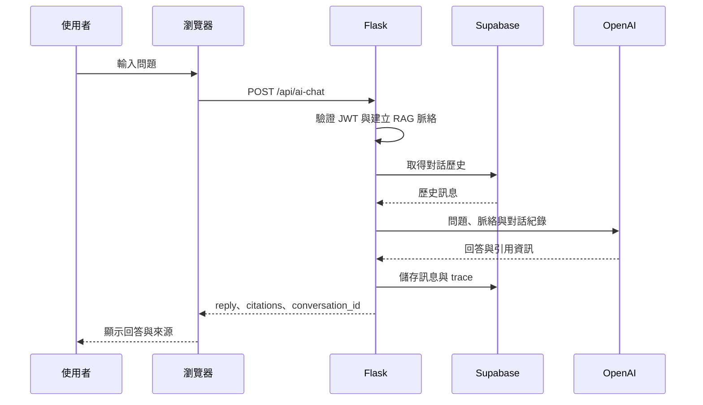
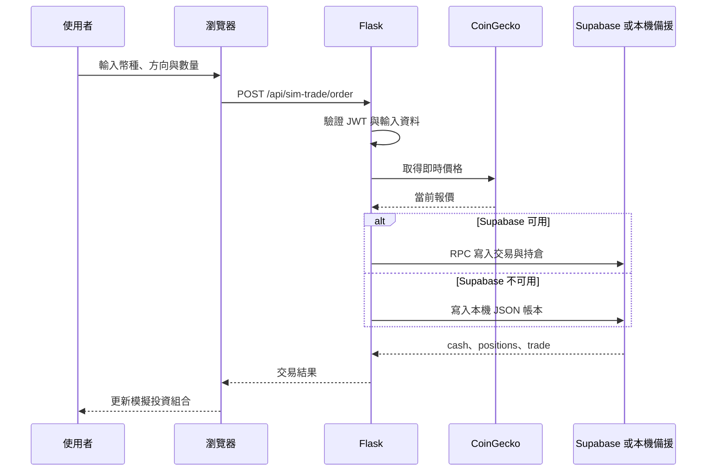
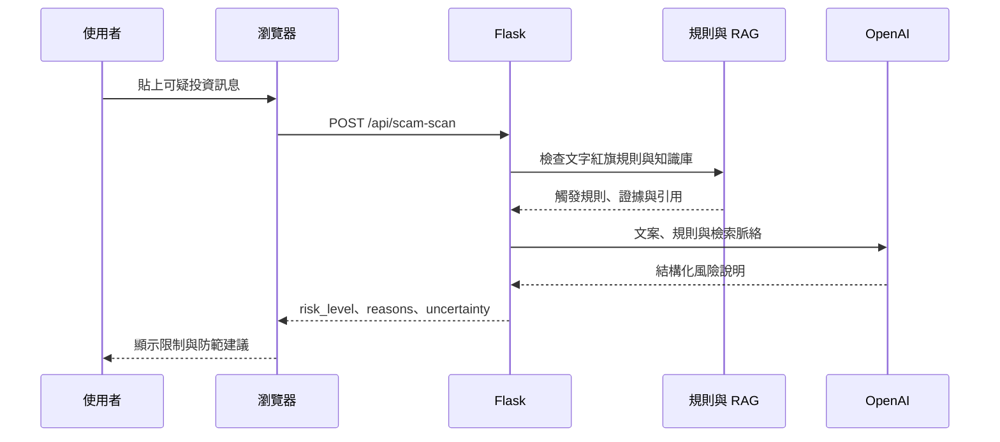
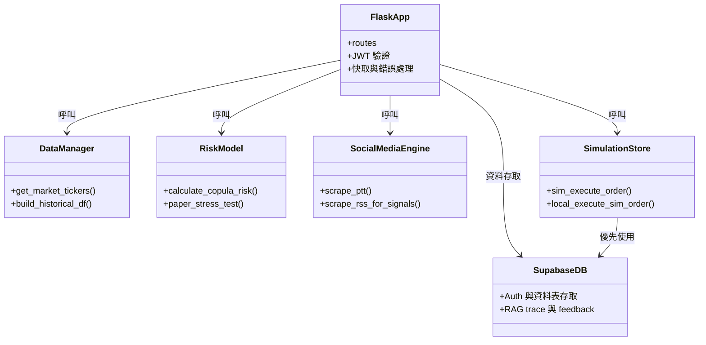
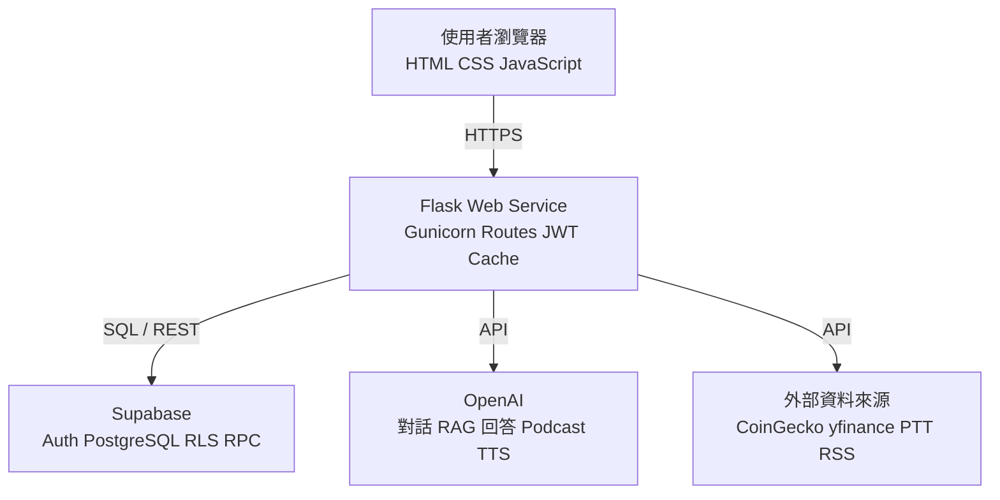
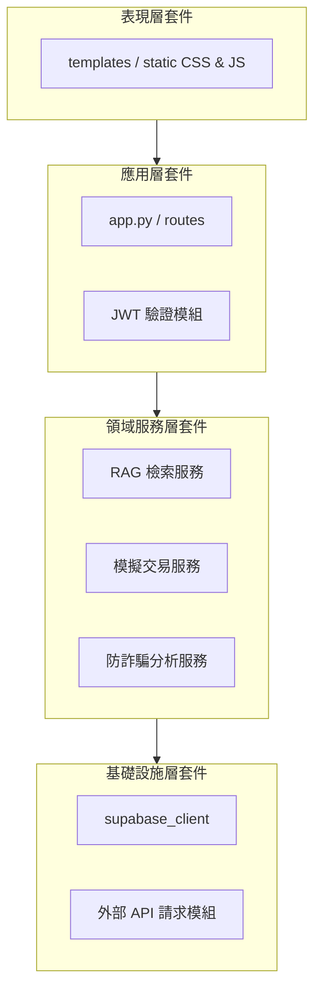
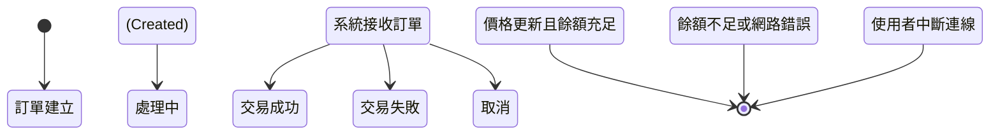
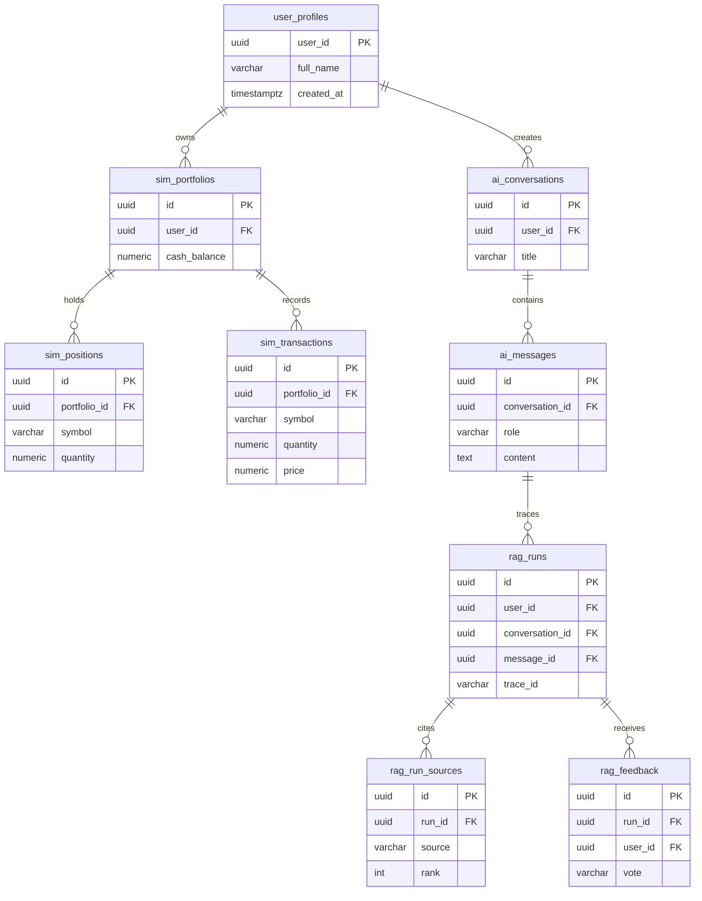

# 專題系統架構圖表 (Mermaid 原始碼)

本檔案包含第 6 至 8 章的所有系統圖表。在 GitHub 上檢視本檔案時，Mermaid 區塊會自動渲染成視覺化圖表。

## 6-1-1 AI 投資教練對話流程


## 6-1-2 模擬交易下單流程


## 6-1-3 可疑文案辨識流程


## 6-2 設計類別圖


## 7-1 部署圖


## 7-2 套件圖


## 7-3 元件圖
```mermaid
flowchart LR
    component1[交易請求元件\n(Trade Request Component)]
    component2[價格獲取元件\n(Price Fetcher Component)]
    component3[餘額驗證元件\n(Balance Validator Component)]
    component4[資料庫寫入元件\n(DB Access Component)]
    
    interface1((REST API 介面))
    interface2((CoinGecko API 介面))

    interface1 --> component1
    component1 --> component2
    component2 -- 請求最新報價 --> interface2
    component1 --> component3
    component3 --> component4
```

## 7-4 狀態機


## 8-1 核心資料庫實體關係圖

